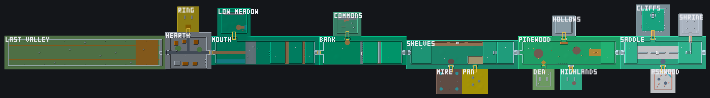

# The atlas — one map, read a tile at a time

*Built 2026-10-09. The code is `crates/sim/src/atlas.rs` (the map and its
tiles), `crates/sim/src/valley/layout.rs` (where the valley's places go),
`crates/sim/src/valley/open.rs` (the rules that make it play as one piece),
`crates/sim/src/arena/mod.rs` (`Terrain`, which every query goes through) and
`crates/game/src/stream.rs` (distance loading). Tests: `sim/tests/atlas.rs`,
`sim/tests/valley.rs`, `net/tests/ggrs_synctest.rs`.*

*`cargo run -p look --example atlas`: every place where the layout put it,
doorways outlined (gold open, grey behind a waystone).*

## Why

An arena is one table of boxes, and every query walked the whole table:
collision, the floor under a point, the aiming ray, a creature's sight. That is
why an arena was capped at sixty-four boxes, and why the valley was a string of
separate rooms joined by teleports ("seams"). The ask was the opposite: **the
whole valley, its fights and Hearth as one contiguous map**, built so that it
can grow to millions of boxes, and it has to work with two players over
rollback netcode.

So there are two problems, and they are separate:

1. **A frame must cost what is near the bodies, not what is in the world.**
   That is a *spatial index*: the map is cut into square tiles, and a question
   reads only the tiles near it.
2. **The screen must hold only what is near the camera.** That is *distance
   loading*: pieces are drawn when the camera comes within reach and dropped
   when it goes away again.

## The map (`sim::atlas`)

- **Places on one map.** Each place is still an arena, drawn in its own
  coordinates exactly as before. The map puts each one at an offset, cuts the
  doorways where two places meet, and adds the few boxes that belong to no
  place (a cliff round a room, a door's sill). The valley's map is 18 places,
  17 doorways and about 600 boxes.
- **Tiles.** The map is cut into 16 m squares. Each tile lists the boxes that
  touch it, in map order, and the places whose footprint does. A query over a
  box reads the tiles under it and merges their lists in map order, each box
  once. The busiest tile in the valley holds 18 boxes, so a body's collision
  reads a few dozen boxes however large the map grows. `tests/atlas.rs` checks
  that a query never misses a box (against walking every box, 2,000 random
  queries over a thousand scattered boxes), and that a map a hundred times
  bigger costs a body-sized query no more.
- **Order is kept**, because the collision resolve pushes a body out of one
  box at a time and the order is part of the answer. Map order is the same on
  every machine and does not depend on where a question is asked from.
- **Built once, never in a frame.** The map is composed the first time it is
  asked for, which is when a valley world is built, and never changes after.
  It is not in the snapshot: both peers build the same map from the same
  tables, the same way they read the same arena tables. A frame that reads it
  allocates nothing (`tests/budget.rs` has two valley scenarios).
- **The 64 cap now means something narrower.** `arena::MAX_SOLIDS` holds for
  an arena that is fought on *alone* (a creature's own arena, a course),
  because alone it is still one table walked end to end. A place that only
  ever lives on a map — the town and the reaches — is not held to it.

## Where things go (`sim::valley::layout`)

Nothing in a place moves. The layout says only **which seam meets which, and
how**, and every position is derived from that, so changing a reach moves
everything after it:

- **A passage** meets a passage end to end. The second place goes where its
  passage's mouth touches the first's, on the same line, with the floors at
  the same height. The caps that closed both ends are cut.
- **A room** sits beyond the notch that led to it. Most rooms are walled with
  low walls, which were fine when the world ended at them and are not on one
  map, so a room gets **6 m of ground round it and a cliff round that**: a
  wall hopped is a fall onto grass, not out of the world. The doorway is cut
  from the notch, through the cliff and the apron, `depth` past it into the
  room's own wall, at the notch's floor height, with a sill under it that
  carries you across anything lower (the Cliffs' shelf).

Three things changed in the places themselves, because one map forced them:

- **The Bank's den** was a cave mouth in the bank's face with the bank behind
  it: no room fits there. It is a notch in the north wall now, like every
  other room's.
- **The Shrine** was on the second spire's top: a 33 m room cannot sit on a
  spire in the middle of the Saddle. A bridge runs from the spire's top
  through the north wall, 36 m up, and the Shrine is there.
- **The Long Valley no longer loops back to the Saddle.** The climb runs east
  from Hearth and the Long Valley runs west from it; they cannot meet. It is
  reached through Hearth's west gate, under the fifth waystone, which is what
  it was gated by from that end before. The Saddle's east passage is a dead
  end with a dark waystone.

## Playing it as one piece (`sim::valley::open`)

- **The world runs in the coordinates of the place it is in** (`World::arena`).
  Every position in the snapshot is in that place's coordinates, so a
  creature's fight is exactly the fight it was tuned in, floor at zero and
  all. The rest of the map is around it, solid, through `Terrain`: a query
  moves its box onto the map, reads the tiles, and moves each box it finds
  back into the place's coordinates.
- **The frame follows the fighters.** When the first fighter on their feet
  walks into another place, the world moves into that place's coordinates:
  every position it keeps shifts by the difference between the two places'
  origins, a whole number of fixed-point units, on the same frame on both
  machines. `tests/valley.rs` (`a_change_of_frame_changes_nothing`) moves a
  world of every class, with every mechanic out, into another place's
  coordinates and checks it plays on and comes back identical; a field the
  shift forgot would show up there.
- **Walking into a room starts its hunt.** The creature is put on its marks,
  noticing you as it always has. A hunt holds the world in its room while
  anybody on their feet is in it; when nobody is, the hunt is over, unwon,
  and the creature is gone. Won, the room goes quiet; lost, you wake outside
  its door, as before.
- **A dark waystone's door is a wall**: a box the shape of the doorway, raised
  on the ground the way a slag mound is, unless somebody already stands on
  its far side (so starting further up with `--arena` never strands you).
- **Cairns** are counted by their index on the map, so a checkpoint is one
  box of the map wherever the world's frame is.

## Two players

Both peers simulate the whole snapshot, and the snapshot holds only what is
near the party: the two fighters, what they have thrown, and the one live
hunt. The map itself is static data both peers already have, so nothing about
it goes on the wire. `net/tests/ggrs_synctest.rs` walks two fighters out of
Hearth's gate and into the Highlands under SyncTest's forced rollbacks with
random buttons pressed, which re-simulates the frame the world changes place
over and over; neither desyncs.

**What this does not do yet** is let the two players be far apart *and* both
be in fights: there is one live hunt at a time, in the room the world is in.
That, and more than two players, is the overlapping-region design on the
unmerged branch `claude/brave-cray-d08zzb` (`regions.md` there,
[exploration/0005](exploration/0005_open_world_netcode.md) when it lands):
hexagonal regions with their own checksums, so peers only exchange inputs
with peers near them. The map's tiles are not those regions and do not need
to be — tiles are how a query finds boxes; regions are who must agree about
a frame — but a region layer would sit on top of this map unchanged.

## Distance loading (`game::stream`)

In the valley, the renderer draws two kinds of piece, each loaded when the
camera comes within reach and dropped when it goes further than that by
another 60 m (so the edge never flickers):

- **A place**: its floor, the patches on it, its props, what is scattered on
  its floor, its seams and vines, under one entity.
- **A box**: each box of the map on its own, found through the tiles round
  the camera, so loading reads the tiles near the camera and not the map.

The reach is the current sky's own (`look::Sky::reach`, clamped to 160–600 m):
past it the fog is the horizon's colour, so a piece loading there cannot be
seen arriving. Everything hangs off one root at the map's origin as seen from
the current place, so when the world moves into another place's coordinates
only the root moves; the interpolator's previous frame and the camera's
smoothed focus are moved with it (`same_frame`, `CameraRig::shift`). `--dev`
shows how much is loaded under the place's name.

## Toward millions of boxes

What is built scales; what will need doing when the content arrives:

- **Fixed-point range.** Positions are 16.16, so about ±32 km from the place
  the world is in. The valley is 1.4 km across. A world much past 30 km needs
  places beyond that range to never be in the same frame, which the
  per-place frame already gives, as long as the queries' boxes are converted
  in 64 bits; they are not yet.
- **Where the boxes come from.** The valley's map is composed from Rust
  tables at start-up. A million boxes wants a baked file loaded once (the
  simulation does no I/O, so the game hands it over), with the same tiles;
  nothing in a query would change.
- **Streaming the map's data**, not just its meshes, is only needed if the
  map stops fitting in memory, which at 28 bytes a box is far past a million.
- **Mesh building on the main thread.** Loading a place builds its meshes in
  one frame. With 600 boxes that is invisible; with dense content it wants
  spreading over frames or a task pool.

## Open

1. **Nobody has walked it.** Every doorway is walked by a test; nobody has
   looked at how the joins read, in particular the rooms' aprons and cliffs.
2. **The sky changes at a doorway.** Each place still has its own sky and
   light, and the world takes the new one when it moves. A blend across a
   doorway is the obvious next step.
3. **The Long Valley's loop** (above): whether a return trail from the Saddle
   to Hearth's west is worth building.
4. **`seam_hold`** is in the Oven and read by nothing since seams stopped
   being teleports; it goes when the tuning hash is next re-pinned on purpose.
5. **A fighter in a place lower than the one the world is in** takes no fall
   damage there: the fall rule measures from zero up. It only happens to the
   second player while apart from the first.
