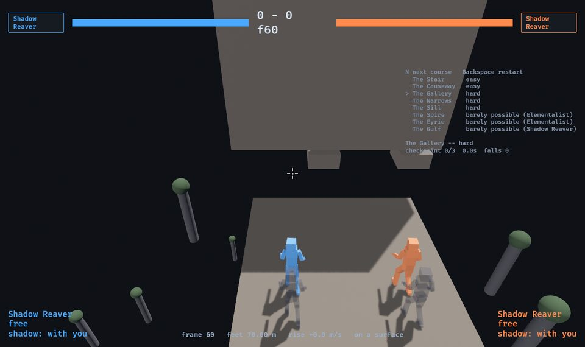

# Jump courses — the movement envelope, and courses built against it

[world.md](world.md) §2 describes **trails**: "short traversal places with no
creature, where the challenge is the movement system itself". These are the
first ones, and they are **measuring instruments as much as content**: what each
class can actually do with its feet, played in the simulation, and courses built
against it, every hop measured for every class.

```
cargo run -p game -- --arena gallery --p1 reaver   # desktop; N steps to the next course
?arena=gallery&p1=reaver                            # the browser build, the same
cargo run --release -p sim --bin envelope          # §1: what each class can do (about 16 minutes)
cargo run --release -p sim --bin courses           # §5: every hop, every class, its window (about 8)
cargo run --release -p sim --bin courses -- --bench   # §4: a kind of hop, measured before it is built
cargo test -p sim --test courses --test search --test corner
```

## 0 · What these are for

The owner's goal, as given on 2026-10-03:

- **The game is hard, and gated by skill**, Dark-Souls fashion. Movement is
  part of that challenge, not only the fights: fights will sit in the middle
  or at the end of long movement-gated stretches of wilderness.
- So **the main route is difficult and every class can finish it**, even if
  some find it easier. No class's tools should make a hard section trivial, and
  no class should find one impossible. Only the *barely possible* routes may
  end up belonging to a class.
- **The Bulwark is out of this exercise** by the owner's choice: it may not fit
  an athletic, agile hunter game. It is not measured here and nothing is built
  for it. Five classes: the Reaver, the Elementalist, the Blood mage, the Dual
  mage and the Champion.

**Decided, 2026-10-03: a movement tool's reach is paid for in execution --
timing, aim, precision -- never in waiting, and never free.** A tool that
reaches far with no timing to it, or reaches far after standing still long
enough, is the thing to fix. (Also in [README.md](README.md) §1.)

**Decided directions, not built.** The owner, from round one's numbers:

- **The Dual mage needs fixing.** The approach is undecided; the owner calls it
  "the stickiest problem". Her plain jump is the best in the game (§1) and her
  tiers are bought by waiting, which the rule above rules out.
- **The Reaver's shadow is to be made less trivial.** The leading idea is a
  **shorter shadow range**, so that the dash jump carries her mobility rather
  than the send; perhaps also stopping the shadow from going "just anywhere".
  §6 has what the numbers say about a shorter range.
- **The Blood mage needs better movement tools**, ideally a way to make a pool
  to blink to without an enemy. Not built.

**Round three, 2026-10-04.** The owner played round two's courses: "They're all
essentially trivial except for spire. I flashed every single one without really
trying." And: "It's not a bad thing if the core movement is actually roughly the
best a class can do as long as that's true of every class." So shared movement
carrying most of the reach is fine; what matters is that **the hard tier is hard
for a human on every class**, and no class's tools make it trivial. Every
course but the two easy ones and the Spire was rebuilt (§2), against a new
measure of difficulty (§4): **the timing window**.

This document is diagnosis: which tools trivialise which hops, and which
classes cannot do what the others find merely hard (§6). What to do about either
is the owner's call.

## 1 · The envelope

`cargo run --release -p sim --bin envelope`, played in **the lab**
(`--arena lab`, `sim::arena::lab`): a 40 m runway with a real edge, seventeen
hanging ledges half a metre past it from 8 m below the runway to 45 m above it,
and a floor for the flat measurements.

**The search** (`sim::search`, round two): a program is a few numbers and a short
list of timed inputs built from the blocks a player has -- the run-up; the stick
let go, then **Quake strafing** at an angle off the line of motion, the camera
turning with it; a jump held so many frames; the airdodge; any click, which in
the air is the class's aerial and **hangs** her; the class keys; a button held
with the crosshair on a point (shadow, stone, Grasp); the dash; the vault -- and a
seeded hill climb finds the line that crosses the widest gap. 2,000 runs a
search, best of three seeds, twice per cell (the **shared** blocks: jump,
airdodge, clicks, strafe; and the **whole kit**), about 1.2 million runs.
**A search gives a lower bound**; every claimed line is in
`crates/sim/tests/fixtures/envelope.txt` and replayed by `tests/search.rs`.

The gap is from the last place her feet were on the runway to where they came
down, plus a body's radius; the first touch of the ledge is the landing.

| Rise | −8 m | −4 m | −2 m | 0 | +1 m | +2 m | +3 m | +4 m | +5 m | +6 m | +8 m | +10 m | +12 m | +16 m | +20 m | +30 m | +45 m |
| --- | --- | --- | --- | --- | --- | --- | --- | --- | --- | --- | --- | --- | --- | --- | --- | --- | --- |
| Reaver, shared | 50.0 | 49.7 | 48.4 | 45.2 | 15.1 | 43.8 | 12.7 | 10.9 | 6.6 | – | – | – | – | – | – | – | – |
| Reaver, kit | **65.1** | 50.8 | 48.6 | 46.2 | **60.1** | 44.1 | 12.7 | 10.9 | **54.1** | – | – | – | – | – | – | – | – |
| Elementalist, shared | 25.5 | 21.4 | 18.0 | 15.7 | 14.3 | 12.1 | 10.5 | 9.1 | 6.4 | – | – | – | – | – | – | – | – |
| Elementalist, kit | 54.2 | 44.2 | 38.9 | 50.8 | 42.0 | 48.3 | 10.5 | 16.9 | 42.0 | 45.7 | 41.2 | 46.6 | 36.1 | 41.0 | 41.6 | 36.4 | 10.9 |
| Blood mage | 20.6 | 15.9 | 14.6 | 12.0 | 10.4 | 9.4 | 8.2 | 6.0/6.2 | – | – | – | – | – | – | – | – | – |
| Dual mage | 35.7 | 31.4/31.7 | 29.2 | 25.9 | 24.3/24.5 | 23.1 | 21.1 | 18.0 | 14.7 | 8.6/8.8 | – | – | – | – | – | – | – |
| Champion, shared | 28.6 | 43.0 | 34.6 | 48.1 | 44.4 | 30.8 | 28.6 | 24.6 | 25.1 | 22.7 | 20.2 | 15.8 | – | – | – | – | – |
| Champion, kit | 45.6 | 53.9 | 42.5 | 58.5 | 49.4 | 41.3 | 37.1 | 32.0 | 32.7 | 51.9 | 53.6 | 34.1 | 31.0 | 25.4 | – | – | – |

Metres, after the corner fix below; `–` nothing found. The Reaver's "shared"
uses her shadow too: right click is the send and the dodge with the crosshair on
it is the dash, both shared buttons. The Dual mage has no tiers (they are bought
by waiting, §0); the Champion's "shared" includes his takeoffs (space and a
click). The best line in almost every cell is one or two frames wide.

**What the restored dash jump did to the Reaver** (the coordinator's `e8994e2`:
a jump in the carry keeps all of the dash's flat speed, bled by the dodge decay
per carry frame; a press in the dash's last six frames is banked). Round two had
her at 32 m level and 27.9 m at +5; now **45–65 m at every rise to +2 and 54 m at
+5**, the longest reach of the five. On the flat (`envelope -- flat`): sent 9 m,
the dash, space on the first carry frame, stick forward -- **58.5 m from where she
stood, 49.5 m past the shadow**; only that first carry frame lands within half a
metre of it, so the long dash jump is itself a one-frame input. With it, **a
shorter shadow range no longer limits her** (`envelope -- range`: a 3 m send
gives 62 m level, against 47 m at 9 m -- noise in a lower bound, but the point
stands): her reach comes from the dash's speed, not its length. Round two's
range analysis no longer applies.

Round one's plain running jump and one airdodge is still printed
(`envelope -- gaps`): 7.4–8.9 m level. The rest of what produces the reach --
the strafe to 14.2 m/s, the hang, the poke's 3 m/s shove, the Elementalist's air
shots (no recoil: hang and shove only), stones launched from a run, the
Champion's takeoffs, vault and air Rush -- is unchanged from round two.

### The corner clip, fixed

Round two's search found that a jump clipping a ledge's near top corner on the
way up was lifted onto the top by the resolve (the vertical overlap is the
shallowest there), **counted as standing**, and a still-held jump fired a second
takeoff stacked on the first's speed -- about 27–30 m/s up. Fixed in
`arena::resolve_among`: a body lifted onto a top while still rising is put on the
top and keeps rising; it is grounded only once it is not rising. Pinned by
`tests/corner.rs` (every class into the lab's +1 and +2 m corners, sixty takeoff
frames each). Every other test is unchanged by it except one, and that one is not
about it: `tests/pair.rs`'s `the_two_never_land_within_the_gap_except_the_twin_pounce`
runs a scripted hunt whose fighter now moves slightly differently, and on its four
seeds the cats then break the stagger gap once (a Swat 15 frames after the other's
hit). The property is already breakable without the fix -- on the base commit the
same check over seeds 1–24 fails too (a Rake 18 frames after) -- so it is a
latent fault in the Pair's coordination, surfaced, not caused. Left failing and
reported rather than reseeded.

## 2 · The courses

The look stays the Hallelujah Mountains': islands of rock hanging **sixty
metres and more over a floor drawn nearly black** (`Dressing::below`: unlit, no
shadows, two kilometres across), far floating peaks, and since round three, far
below, **spires of rock crowned with trees** for the eye to measure the drop by.
The hard courses add **tunnels of roofs**: a slab over every gap, six metres
thick, its underside a hand above a standing head.



| Course | `--arena` | Tier | What it is |
| --- | --- | --- | --- |
| The Stair | `stair` | easy | Six islands, each up to 2.5 m higher, gaps 2.5–4 m (unchanged) |
| The Causeway | `causeway` | easy | Level gaps, two stepping stones, a 20 m bridge (unchanged) |
| The Gallery | `gallery` | hard | Seven hops under roofs onto stones 1.5 m across, zig-zagging; one step up |
| The Narrows | `narrows` | hard | Seven hops under roofs onto ledges **60 cm wide**, turning at every one -- so the run-up off each is 60 cm |
| The Sill | `sill` | hard | Seven hops under roofs onto 1.5 m stones, stepping up 30 cm at a time, turning |
| The Spire | `spire` | barely possible | The summit 32 m above the launch, half a metre out (unchanged) |
| The Eyrie | `eyrie` | barely possible | The Spire's taller sister: 38 m up, a metre out |
| The Gulf | `gulf` | barely possible, for some | Two gaps of 12–12.5 m under low roofs |

**Why roofs, and why over the gap only.** Raw reach runs from 12 m (Blood mage)
to 58–65 m (Champion, Reaver), so no single gap is equally hard for all. A
**ceiling caps every way of going far at once** -- the jump, aerial hang, stone
launches, the vault, wings -- and was the one hop round two found equally hard
for everyone. Built over the takeoff island too, it gave the Blood mage
something to Grasp (a roof over a landing is an anchor she is hauled up to and
settles onto: windows of 31); so it covers **the gap alone**, starting at the
takeoff edge and ending at the landing's face, and it is six metres thick so a
jump taken early meets its face, not its top. **Small stones and narrow ledges**
make overshooting a failure; **turns** take the run-up away (a 60 cm ledge
crossed sideways is a 60 cm run-up). Each hop's numbers were found on the bench
(§4) and then on the course.

Falling, checkpoints, the clock, `N` and the panel are as before: below the pit
(six metres under the lowest island) you are stood fresh on your last
checkpoint; the clock runs from leaving the start to the nest. `N` cycles all
eight courses by tier.

## 3 · The hops, as built

| Course | Hop | Gap | Rise | Roof (over a head) | Target |
| --- | --- | --- | --- | --- | --- |
| Gallery | 1–7 | 3.2, 2.8, 3.4, 3.0, 3.2, 3.0, 3.0 m | 0, 0, +0.3, 0, 0, 0, 0 | 30, 25, 30, 30, 30, 25, 30 cm | 1.5 m stones; the nest 1.5 m |
| Narrows | 1–7 | 3.0, 2.5, 3.0, 3.0, 3.2, 3.0, 2.6 m | 0 | 20, 25, 25, 20, 25, 25, 25 cm | ledges 60 cm × 3 m; the nest 1.5 m |
| Sill | 1–7 | 3.2, 3.0, 3.6, 2.8, 3.2, 3.4, 3.0 m | +0.3, 0, +0.3, 0, +0.3, +0.3, 0 | 30, 30, 30, 25, 30, 30, 30 cm | 1.5 m stones; the nest 1.5 m |
| Spire | 1–3 | 5, 5, 0.5 m | +1, +1, **+32** | – | the summit 8 m |
| Eyrie | 1–3 | 5, 5, 1 m | +1, +1, **+38** | – | the summit 6 m |
| Gulf | 1–3 | 5, 12.5, 12 m | 0 | –, 30, 30 cm | 3 m islands |

## 4 · The difficulty measure: the window

A course is hard if it is hard to do **reliably**, not if few lines exist. So
for every hop and class the instrument (`sim::coursecheck::loosest`) takes the
search's best few landing lines from two seeds, strips each of every input it
does not need, nudges its timing toward forgiving, and keeps **the most
forgiving line**. Its **window** is how many of the 31 frames from fifteen early
to fifteen late its tightest input can be pressed on and still land. That is
the number in every cell of §5. A miss is retried at three times the budget
before it is called a miss: on the Narrows the Blood mage's "no" at 1,500 runs
was a 7-frame line at 4,000.

**The band**, from the coordinator's brief: easy hops wide; **hard hops 3 to 7
for every class, none above about 8**; barely possible **1 to 2**. A hop where a
class has 15 or more is trivial for that class.

What the window does not see, and so where it is generous or harsh:

- **Aim.** The Reaver's shadow and the Blood mage's Grasp are aimed at a point;
  the window times the press, not the aim, so a line that needs the crosshair
  placed well but not timed well reads as forgiving.
- **Rest.** Every hop starts fresh, standing still in the middle of its island:
  a sequence that lands straight into the next takeoff is not measured as one.
- **A search is a lower bound on forgiveness too.** A narrow window may be a
  wide line not found. The windows were stable to within a few frames between
  runs; the misses were not.

`cargo run --release -p sim --bin courses -- --bench` measures a kind of hop on
the bench arena (`sim::arena::bench`, generated per experiment) before it is
built into a course. What round three found there:

| Kind of hop | Reaver | Elementalist | Blood mage | Dual mage | Champion |
| --- | --- | --- | --- | --- | --- |
| Open, level, 6–12 m onto 5 m | 19–30 | 11–23 | 15–20 | 19–31 | 7–20 |
| Open small target, up 1.5–3 m | 9–31 | 10–21 | 1–28 | 13–24 | 7–27 |
| Roof over everything, 2.2–3.8 m | 1–12 | 1–10 | **3–31 (Grasp to the roof)** | 8–19 | 2–31 |
| Roof over the gap only, 2.4–4 m | 1–11 | 3–12 | 1–12 | 4–20 | 8–24 |
| Roof over the gap onto a 1.5 m stone | 1–8 | 3–10 | 4–8 | 6–19 | 8–20 |

## 5 · The matrix

Each class's most forgiving line on every hop (window of 31), and any tool past
the jump, airdodge and strafe it uses. Measured, every cell
(`cargo run --release -p sim --bin courses`, 1,500 runs a search). **Bold** is
outside the hard band (above 8). Every line is a fixture in
`crates/sim/tests/fixtures/courses.txt`, replayed by `tests/search.rs`, which
also holds that every class finishes all three hard courses.

### The Gallery (hard)

| Hop | Reaver | Elementalist | Blood mage | Dual mage | Champion |
| --- | --- | --- | --- | --- | --- |
| 1. 3.2 m under a roof onto a stone | 4 | 4 | 4 | **12** | **19** |
| 2. 2.8 m, turning | 5 shadow | 7 | 6 | **10** | 8 |
| 3. 3.4 m and a step up | 7 shadow | 8 stone | **16 Grasp** | **9** airdodge | 8 |
| 4. 3 m, turning back | 8 | **9** | 5 | **16** | 3 |
| 5. 3.2 m | **9** shadow | 8 stone | 4 | **14** | 8 |
| 6. 3 m, turning | **9** shadow | 7 | 4 | **11** | 8 |
| 7. 3 m to the nest | 5 | **9** | 5 | **9** | **9** |

### The Narrows (hard)

| Hop | Reaver | Elementalist | Blood mage | Dual mage | Champion |
| --- | --- | --- | --- | --- | --- |
| 1. 3 m onto a 60 cm ledge | **16** shadow | 7 | 2 | **16** | 8 Rush |
| 2. 2.5 m, turning | 7 | 1 stone | 7 | **26** | 3 |
| 3. 3 m | 3 dash | 7 | 7 Grasp | **26** | **24** Rush+vault |
| 4. 3 m, turning back | 5 | 7 | 2 | **16** | 8 |
| 5. 3.2 m | 2 | 5 | **31 Grasp** | **9** | 7 |
| 6. 3 m, turning | 6 shadow | 1 Updraft | 3 | **23** | 8 |
| 7. 2.6 m to the nest | 7 | 1 stone | 6 | **21** | 8 |

### The Sill (hard)

| Hop | Reaver | Elementalist | Blood mage | Dual mage | Champion |
| --- | --- | --- | --- | --- | --- |
| 1. 3.2 m and up 30 cm | **31** shadow | **10** | **9** | **9** | **15** Rush+vault |
| 2. 3 m, turning | **11** | **9** | 5 | **11** | 8 |
| 3. 3.6 m and up | **9** shadow | **9** | 2 | **9** | 8 |
| 4. 2.8 m, turning | 6 shadow | 3 | 7 | **17** | 8 |
| 5. 3.2 m and up | **14** shadow | 7 | 5 | **10** | 8 airdodge |
| 6. 3.4 m and up, turning | 3 | **11** | 3 | **9** | 8 |
| 7. 3 m to the nest | 7 shadow | **9** | 5 | **13** | **18** Rush+vault |

### The barely possible

| Course, hop | Reaver | Elementalist | Blood mage | Dual mage | Champion |
| --- | --- | --- | --- | --- | --- |
| Spire 3: up 32 m | no | **2**, two stones | no | no | no |
| Eyrie 3: up 38 m | no | **2**, two stones | no | no | no |
| Gulf 2: 12.5 m under a roof | 13 shadow+dash | 26 stone | no | no | 7 Rush+vault |
| Gulf 3: 12 m under a roof | 4 shadow+dash | 26 stone | no | no | 4 Rush+vault |

The approach hops of the Spire, the Eyrie and the Gulf are easy (15–31) on
purpose. The easy courses: every hop 16–31 for every class.

## 6 · Observations

Facts and measurements; nothing has been played by a person since round two.

**Where the hard band holds.** On the Gallery and the Sill the Reaver, the
Elementalist, the Blood mage and the Champion sit at **2 to 11** on almost every
hop -- the band, give or take a few frames -- and on the Narrows the same four sit
at 1 to 8 on most hops. **The roof is the equaliser**: a hand above the head, it
holds every class's jump to about the same arc.

**Where it does not, and why** -- one tool per class:

- **The Dual mage, almost everywhere: 9 to 26.** Her autos hang her for 18
  frames, the longest in the game, and a roof does nothing to a hang: she sits
  at the ceiling and keeps travelling. The Narrows' turning hops (her 16–26) are
  where it shows most. No geometry tried here brings her into the band without
  pushing another class out of reach; it is the hang, not the course.
- **The Champion's Rush and vault: 15 to 24** on four hops (the Gallery's
  first, the Narrows' third, the Sill's first and last). The Rush is flat speed
  under any roof; it shows where the takeoff has room to run (the start's foot,
  larger landings).
- **The Reaver's shadow and dash: 14 to 31** on the first hops off the start and
  a few others. The dash is a straight line under any roof and its press is not
  timed -- what it needs is aim, which the window does not measure (§4).
- **The Blood mage's Grasp: 16 and 31** on two hops (the Gallery's step up, the
  Narrows' fifth): a narrow ledge's or a step's own face is an anchor she is
  hauled to and settles on. Elsewhere she is in the band.

So the hard courses are **hard for four classes and not hard enough for the Dual
mage**, with four individual hops trivial for one tool each. This is the same
finding as rounds one and two, measured with a sharper instrument: **the Dual
mage's hang**, the **Champion's Rush**, the **Reaver's untimed dash** and the
**Blood mage's Grasp anchors** are the four things geometry does not equalise.

**The barely possible.** The Spire and the Eyrie are the **Elementalist's**,
on a two-frame window: nobody else reaches +32 m. **The Gulf is not barely
possible for anyone**: it gates out the Blood mage and the Dual mage, and the
Reaver (4–13), the Champion (4–7) and the Elementalist (26, stones launched under
the roof's lip) clear it with room. It needs re-authoring to be one class's.

**Tools that make a section trivial**, now, by measurement: the Elementalist's
stones vertically (the Spire, the Eyrie -- by design, at a two-frame window); the
Dual mage's hang under roofs; the Champion's Rush on flat runs; the Reaver's
dash jump on open ground (65 m, one frame) and her untimed dash under roofs;
the Blood mage's Grasp where a face or roof is over a landing.

## 7 · Props a shared world could give every class

Things the Hallelujah Mountains scene has that the simulation does not, not
built, with what each would do to the matrix:

- **Hanging vines and roots, climbable or swingable by anyone.** The vertical
  answer the Blood mage and the Champion lack; it would flatten the +4/+5 m
  rows, where they have nothing, and make a climb a route rather than a class
  test. It would also make the Elementalist's stone jumps less special wherever
  a vine hangs.
- **Natural updraft vents.** A column anyone can ride: the same as giving every
  class the Elementalist's Updraft, which today adds nothing to her own jump
  (§1) — so a vent strong enough to matter would outclass her Updraft and
  compete with her stone jumps. It would help the short jumpers most.
- **Drifting rocks.** Islands that move on a fixed path: a timing challenge the
  same for every class, which is the kind of gate §0 wants. They would cut
  against the Reaver's shadow (it waits where it was sent, on a rock that has
  moved on) and the Elementalist's stones (raised on a moving top), and the
  sim has no moving solids yet — a moving island is a new kind of thing.

## 8 · Not done, and next

- **The Dual mage's hang** is the one thing keeping the hard courses out of the
  band; the owner's call (§0). If it is shortened, every hard hop should be
  re-measured -- the gaps were set with her as she is.
- **The Gulf** wants re-authoring if it is to be one class's.
- **Aim as difficulty**: the window times presses only. The Reaver's and the
  Blood mage's aimed tools would need an aim tolerance measured the same way.
- **Sequences without rest**: every hop is measured from standing.
- **The Pair's stagger gap** (`tests/pair.rs`, above): a latent fault in the
  cats' coordination, surfaced by the corner fix.
- **A longer search**: every number is a lower bound.
