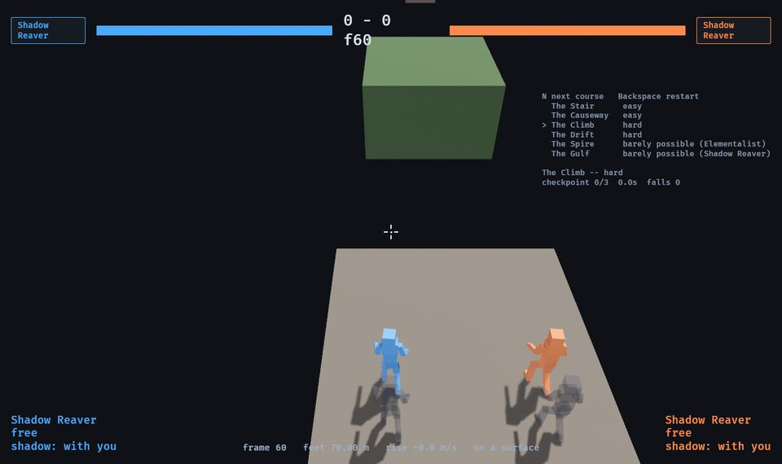
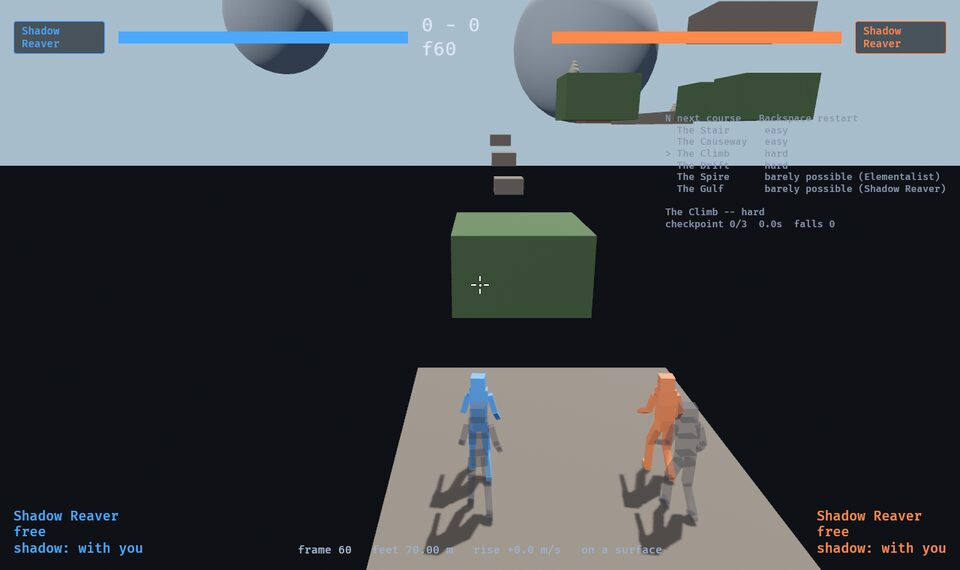

# Jump courses — the movement envelope, and courses built against it

[world.md](world.md) §2 describes **trails**: "short traversal places with no
creature, where the challenge is the movement system itself". These are the
first ones. They are **measuring instruments as much as content**: what each
class can actually do with its feet, played in the simulation, and six courses
built against those numbers. Every hop in them is measured for every class.

```
cargo run -p game -- --arena climb --p1 reaver     # desktop; N steps to the next course
?arena=climb&p1=reaver                              # the browser build, the same
cargo run --release -p sim --bin envelope          # §1: what each class can do (about 16 minutes)
cargo run --release -p sim --bin courses           # §4-5: every hop, every class, the margins
cargo test -p sim --test courses --test search     # every line this document claims, replayed
```

## 0 · What these are for

The owner's goal, as given on 2026-10-03:

- **The game is hard, and gated by skill**, Dark-Souls fashion. Movement is
  part of that challenge, not only the fights: fights will sit in the middle
  or at the end of long movement-gated stretches of wilderness.
- So **the main route is difficult and every class can finish it**, even if
  some find it easier. No class's tools should make a hard section trivial, and
  no class should find one impossible. Only the *barely possible* routes may
  end up belonging to a class.
- **The Bulwark is out of this exercise** by the owner's choice: it may not fit
  an athletic, agile hunter game. It is not measured here and nothing is built
  for it. Five classes: the Reaver, the Elementalist, the Blood mage, the Dual
  mage and the Champion.

**Decided, 2026-10-03: a movement tool's reach is paid for in execution --
timing, aim, precision -- never in waiting, and never free.** A tool that
reaches far with no timing to it, or reaches far after standing still long
enough, is the thing to fix. (Also in [README.md](README.md) §1.)

**Decided directions, not built.** The owner, from round one's numbers:

- **The Dual mage needs fixing.** The approach is undecided; the owner calls it
  "the stickiest problem". Her plain jump is the best in the game (§1) and her
  tiers are bought by waiting, which the rule above rules out.
- **The Reaver's shadow is to be made less trivial.** The leading idea is a
  **shorter shadow range**, so that the dash jump carries her mobility rather
  than the send; perhaps also stopping the shadow from going "just anywhere".
  §6 has what the numbers say about a shorter range.
- **The Blood mage needs better movement tools**, ideally a way to make a pool
  to blink to without an enemy. Not built.

This document is diagnosis: which tools trivialise which hops, and which
classes cannot do what the others find merely hard (§6). What to do about either
is the owner's call.

## 1 · The envelope

`cargo run --release -p sim --bin envelope`, played in **the lab**
(`--arena lab`, `sim::arena::lab`): a 40 m high runway with a real edge, and in
front of it seventeen ledges, one per lane, each half a metre out, from 8 m
below the runway to 45 m above it; and a floor for the flat measurements.
Everything is scripted input into a `World`; nothing is read off the prose.

### Round two: the search

Round one wrote one route per tool by hand, and **underestimated every class**:
the owner's words were that "the class mechanics can do really crazy things
when you include the floatiness of autos and grasp". Round two searches instead
(`sim::search`): a **program** is a few numbers and a short list of timed
inputs, built from the blocks a player has --

- how far back from the edge to start (the run-up);
- the stick in the air: let go until a chosen frame, then **Quake strafing** --
  held at a chosen angle off the line of motion, turned toward the goal, the
  camera turning with it;
- a jump held so many frames; the airdodge; any click, which in the air is the
  class's aerial and **hangs** her; the class keys (`Q`, `E`, `F`); a button
  held with the crosshair on a point (the Reaver's shadow, a stone, the Blood
  mage's Grasp); the dash to the shadow; the Champion's vault --

and a seeded random search with hill climbing finds the program that crosses
the widest gap: elite of six, one to three mutations a child (move, retime,
re-aim, add or drop an input, change the start or the strafe), seeded with the
lines a player would try first, **2,000 runs a search, best of three seeds a
cell**, twice a cell: with the **shared** blocks (jump, airdodge, clicks,
strafe) and with the **whole kit** (started from the shared line, with the
class's tools tried at the end of it). About 1.2 million runs for the table, a
quarter of an hour.

**A search gives a lower bound.** It finds what it finds in its budget. Three
rounds of it moved the Reaver's level gap from 14.0 to 16.4 to 32.1 m as the
budget and the seeds grew, and some neighbouring cells disagree for the same
reason (the Reaver at +1 m, 15.3, under +2 m, 29.5). Read a cell as "at least
this", never "at most".

**Every number in the table is a replayable run.** The best program of every
cell is written to `crates/sim/tests/fixtures/envelope.txt`
(`--fixtures`), and `tests/search.rs` replays each one and checks it still
lands across the gap it claims.

**The gap** is measured from the last place her feet were on the runway to
where they came down on the ledge, plus a body's radius -- the edge a player
standing there could have been on, and the face a ledge that far out could
have had. The first touch of the ledge is the landing: a jump that catches its
near corner on the way up is stood on the top there (see §6, the corner).

| Rise | −8 m | −4 m | −2 m | 0 | +1 m | +2 m | +3 m | +4 m | +5 m | +6 m | +8 m | +10 m | +12 m | +16 m | +20 m | +30 m | +45 m |
| --- | --- | --- | --- | --- | --- | --- | --- | --- | --- | --- | --- | --- | --- | --- | --- | --- | --- |
| Reaver, shared | 39.6 | 22.2 | 32.0 | 31.1 | 15.1 | 29.5 | 12.7 | 10.9 | 6.3 | – | – | – | – | – | – | – | – |
| Reaver, kit | 40.2 | 22.9 | 32.3 | 32.1 | 15.3 | 29.5 | 12.7 | 10.9 | **27.9** | – | – | – | – | – | – | – | – |
| Elementalist, shared | 25.5 | 21.4 | 18.0 | 15.7 | 14.3 | 12.1 | 10.5 | 9.1 | 6.6 | – | – | – | – | – | – | – | – |
| Elementalist, kit | **54.2** | **44.2** | **38.9** | **50.8** | **42.0** | **48.3** | 10.5 | 16.9 | **26.0** | **45.7** | **41.2** | **46.6** | **36.1** | **41.0** | **41.6** | **36.4** | 10.9 |
| Blood mage, shared | 20.6 | 15.9 | 14.6 | 12.0 | 9.4 | 9.4 | 8.2 | 5.6 | – | – | – | – | – | – | – | – | – |
| Blood mage, kit | 20.6 | 15.9 | 14.6 | 12.0 | 9.4 | 9.4 | 8.2 | 5.6 | – | – | – | – | – | – | – | – | – |
| Dual mage, shared | 35.7 | 31.4 | 29.2 | 25.9 | 24.3 | 23.1 | 21.1 | 18.0 | 14.7 | 8.4 | – | – | – | – | – | – | – |
| Dual mage, kit | 35.7 | 31.7 | 29.2 | 25.9 | 24.5 | 23.1 | 21.1 | 18.0 | 14.7 | 8.4 | – | – | – | – | – | – | – |
| Champion, shared | 28.6 | 43.0 | 34.6 | **48.1** | 30.4 | 30.8 | 28.6 | 26.0 | 25.1 | 22.7 | 20.2 | 15.8 | – | – | – | – | – |
| Champion, kit | 45.6 | **53.9** | 42.5 | **58.5** | 39.6 | 41.3 | 37.1 | 35.2 | 42.0 | **51.9** | 25.9 | 34.1 | 31.0 | 25.4 | – | – | – |

Metres; `–` is nothing found. The Dual mage has **no tiers** here: her bars
start empty and the search does not stand and box for them, because they are
bought by waiting (§0). The Champion's "shared" includes his takeoffs -- space
and a weapon is a click.

**How forgiving the best lines are** (`bin/envelope` prints it per cell): the
frames, of 31 from fifteen early to fifteen late, that the tightest input of the
best line can move and still land within half a metre of the same gap. Most
cells are 1 to 7: **the best line at the edge of a class's reach is nearly
frame-perfect, for every class.** Every one of the Elementalist's stone lines is
1 or 2.

Round one's table, the plain running jump and one airdodge, is still printed
(`envelope -- gaps`): 7.7 / 9.1 m level for the Reaver, 8.0 / 9.3 the
Elementalist, 6.8 / 8.1 the Blood mage, 8.9 / 9.9 the Dual mage, 6.7 / 8.0 the
Champion. **The search's level gaps are 1.5 to 7 times those.**

### Where the reach comes from

Read from the code and checked in the runs:

- **The strafe.** Air control is Quake's (`state::air_accelerate`): the stick
  held across her motion adds speed without spending it, up to the air speed
  cap of 2.03 × the walk, **14.2 m/s** -- double the 7 m/s she leaves the
  floor with. Every class's best line strafes. The Reaver strafes hardest
  (steering 1.7, against the Elementalist's 1.0).
- **The hang.** An aerial holds gravity off and damps her fall for its hang
  frames (Dual mage autos 18, Elementalist Gale 10 and Air bolt 8, Champion
  air hammer 16, everyone's poke 6–8), each later one in an airtime worth 0.55
  of the last. Chained, they double an airtime.
- **The poke's shove.** The basic aerial (and the Champion's air sword, the
  Elementalist's Air bolt) adds **3 m/s** along the stick, up to the cap.
- **The Elementalist's air shots do not push her.** `gust::throw` puts a gust
  in the world and nothing else: there is no recoil. What the Air bolt gives is
  its hang and the poke's shove; the Gale only its hang.
- **The Elementalist's stones, from a run.** A stone raised *ahead* of her
  running feet -- where they will be when it erupts -- launches her with her
  7 m/s still under her, and she strafes and hangs from there: **51 m level,
  46 m at +10, 41 m at +20**. Every such line has a window of 1 or 2 frames.
- **The Champion's takeoffs, vault and air Rush.** The spear takeoff (pole
  drive) lifts 24 m/s and adds 11 m/s forward; the vault lifts 25 m/s and keeps
  0.55 of a 19 m/s Rush; and **the Rush works in the air** -- 19 m/s flat for 20
  frames once its 90-frame recharge is back. His best lines chain a takeoff,
  aerials, an air Rush and a vault: **58.5 m level, 34 m at +10, 25 m at +16.**
- **The Reaver's dash jump** keeps 20 % of the 50 m/s dash, 10 m/s -- under the
  strafe's cap, so off her own edge it is no better than a strafed jump. Its
  value is the dash: a send thrown in the air, the dash to it **mid-air**, and a
  jump out of that carry (`state::step_player` lets the carry's jump fire off
  the floor) -- her best level line does exactly that, 32 m. On the flat
  (`envelope -- flat`): sent 9 m, the dash, space on the first carry frame,
  stick forward: **19.6 m from where she stood, 10.6 past the shadow; nine of the
  carry's frames land within half a metre of it.**
- **The shadow on a top above her.** Sent from a jump at a top she can see,
  the dash puts her on it: **27.9 m at +5**, against 6.3 without it. Nothing at
  +6 or above: from the runway she cannot see those tops, and a send at a face
  goes to the floor beneath it (§6).
- **The Blood mage's Grasp** adds nothing found in the lab: she reaches no
  further with it than without (every cell equal). It hauls her to what the
  arms meet -- a face, from below -- not onto a top. On the courses it shows
  once (§5, the Gulf's stone, as the second of a pair).
- **The Dual mage** reaches furthest of anyone on the shared blocks (her
  autos hang longest). Her second jump and wings need tiers she cannot earn
  without something to hit; round one's numbers for them stand (second jump
  22 m level with the bars *set*; wings 65 m up after 22 s of boxing).

## 2 · The courses

**The look** is the Hallelujah Mountains' climb to the banshee rookery:
islands of rock hanging in open air at staggered heights, **sixty metres and
more over a floor drawn nearly black, unlit and wider than the eye reaches**
(round two; it was a pale floor a few metres down, which read as ground), stepping-stone chains of small islands, a long arch, an overhang, and
the finish on the last island, a nest with eggs in it — the rookery the
Galewing would live in. Every island but the first hangs (its bottom is above
the floor); the first is **the foot**, a spire standing on the floor, because a
round starts on the ground under a mark. Grass-topped rock, stone stepping
stones, a wooden nest; far floating peaks in the haze; a cairn on each
checkpoint. The drop is drawn by `Dressing::below` (`game::arenas`): a floor in
one colour, unlit, catching no shadows, two kilometres across.





| Course | `--arena` | Tier | What it is |
| --- | --- | --- | --- |
| The Stair | `stair` | easy | Six islands, each up to 2.5 m higher, gaps 2.5–4 m |
| The Causeway | `causeway` | easy | Read horizontally, drifting down: level gaps, two stepping stones, a 20 m bridge |
| The Climb | `climb` | hard | The ascent to the rookery: every hop near the airdodged edge of the shortest jumpers; stepping stones; a gap under an overhang; the arch |
| The Drift | `drift` | hard | The crossing: long gaps at about one height, drifting down, every one past a plain jump for the shortest jumpers; three stones 1.2 m across |
| The Spire | `spire` | barely possible | Built against the Elementalist: the rookery's spire 32 m above the launch, its face half a metre out |
| The Gulf | `gulf` | barely possible | Built against the Reaver: a shadow on a stone a metre across, the dash jump off it across 9 m, and a last island 5 m up and 8.2 m out |

**How they were built.** Each course is a list of hops — a direction, the gap
from the last island's edge, the rise from its top, the size of the next — and
the arena table (`sim::arena::climb`) and its dressing
(`game::arenas::climb`) were generated from those lists, so the numbers in a
route (`Step::gap`, `Step::rise`) are what stands in the world. The hard courses
put every hop **just inside the airdodged jump of the shortest jumpers** (the
Champion and the Blood mage) **as round one measured them** -- a plain running
jump and one airdodge. Round two's search shows that was the wrong envelope
(§1, §6): they are not hard now, and need re-authoring.

**Falling.** The **pit** is a height below every island (`Course::pit`). Below
it, the course stands you on the middle of **the last checkpoint you reached**,
fresh — full health, your stones, shadow and shield taken back, as a round
starts — and the clock keeps running. The start, the finish, and the islands the
route marks are checkpoints; a cairn stands on each.

**What the sim keeps** (`sim::course`): one `Run` per fighter, twelve bytes —
the furthest gate reached, the falls, when you left the start and how long you
took. In the snapshot (a fall moves a body, so both peers must do it on the same
frame) and hashed only in a course, so every other fight hashes as before.
`World` is 3,984 bytes against the 4,096 cap.
The pit is six metres under the lowest island, so a fall is seen and then
answered; the floor is sixty metres further down.

**Playing one.** `--arena <name>` (`?arena=<name>` in the browser), with
`--p1 <class>` (`?p1=`). **`N`** steps to the next course in order of
difficulty, and from anywhere else to the first; it travels on the wire like
`Shift+H` (`Travel::arena`), so online both players go. `Backspace` restarts.
The panel on the right lists the courses and shows the current one's tier, the
last checkpoint, the clock and the falls; the clock stops at the nest.

## 3 · The hops, as built

| Course | Hop | Gap | Rise | Ask |
| --- | --- | --- | --- | --- |
| Stair | 1–6 | 2.5–4.0 m | 0 to +2.5 m | plain jumps |
| Causeway | 1, 2 | 4.5, 5.0 | 0, −1 | |
| | 3, 4 | 4.0, 4.0 | 0 | stepping stones 2 m across |
| | 5, 6, 7 | 5.5, 3.0, 5.0 | −2, 0, 0 | the bridge, the far island |
| Climb | 1 | 6.0 | +2 | Champion and Blood mage: past the plain jump (5.7, 5.8), inside the airdodge (6.9, 7.0) |
| | 2, 3, 4 | 4.5 each | +1 each | stepping stones 1.5 m across |
| | 5 | 3.6 | +4 | Champion 3.9/4.3, Blood mage 4.1/4.5: the tallest rise either can take |
| | 6 | 7.0 | 0 | past both shortest jumpers' plain 6.7/6.8; inside the airdodge 8.0/8.1 |
| | 7 | 2.5 | 0 | **under an overhang**: a slab 3 m over the takeoff, from 1.5 m before the edge to 1.5 m past the far one |
| | 8 | 5.0 | −2 | onto the arch, 24 m long |
| | 9 | 5.0 | +3 | the rookery: Champion 5.1/6.1 |
| Drift | 1, 3 | 7.2, 7.4 | 0 | past the plain jump of the Champion and Blood mage |
| | 2 | 7.8 | −2 | |
| | 4, 5, 6 | 5.5 each | 0 | stepping stones 1.2 m across |
| | 7 | 8.5 | −4 | |
| | 8, 9 | 6.0, 7.0 | +2, −1 | |
| Spire | 1, 2 | 5.0 | +1 | to the launch |
| | 3 | 0.5 | **+32** | the spire: only the double stone jump (and wings) |
| Gulf | 1 | 6.0 | 0 | |
| | 2 | 7.5 | −0.5 | onto a stone a metre across |
| | 3 | 9.0 | +1.5 | off the stone, no run-up: the dash jump |
| | 4, 5 | 7.5, 8.0 | −3, +1 | onto a stone and off it |
| | 6 | 8.2 | **+5** | higher than any jump but the Dual mage's, nearer than the shadow's 9 m |

## 4 · The instrument

`cargo run --release -p sim --bin courses` (`sim::coursecheck`) searches **every
hop for every class** in the course's own arena: she stands fresh in the middle
of one island (three stones, the shadow at her heel, the Dual mage's bars empty),
and a hop counts when she stands on the next top. For each hop and class:

1. the **shared** blocks, 750 runs; if they land it, that is the cell (`S`);
2. otherwise the **whole kit**, 1,500 runs from each of two seeds, started from
   the shared line;
3. a hop nothing clears alone is tried as a **pair** from the island before,
   over the stepping stone between.

A line found is made **as plain as it goes** (every input it does not need
removed, the strafe dropped if it is not needed) and then **as forgiving as a
short climb makes it**, and its **window** is measured: the frames, of 31 from
fifteen early to fifteen late, that its tightest input can move and still land.
**20 is the most a running jump can show**: fifteen frames early, and the four
frames after her feet pass the edge while her radius still holds her up. Every
line found is in `crates/sim/tests/fixtures/courses.txt` and replayed by
`tests/search.rs`.

The distance margin is read off §1 rather than searched again: the gap a class
crosses at the hop's rise, less the hop's gap. It is from a 60 m runway with a
ledge as deep as anybody wants; an island five metres deep with a stone in
front of it allows less.

## 5 · The matrix

Measured, every cell (`cargo run --release -p sim --bin courses`).

### Who finishes

| Course | Reaver | Elementalist | Blood mage | Dual mage | Champion |
| --- | --- | --- | --- | --- | --- |
| Stair (easy) | yes, shared | yes, shared | yes, shared | yes, shared | yes, shared |
| Causeway (easy) | yes, shared | yes, shared | yes, shared | yes, shared | yes, shared |
| **Climb (hard)** | yes; the shadow on one stepping stone | yes, shared | yes, shared | yes, shared | yes, shared |
| **Drift (hard)** | yes; the shadow on one stone | yes; aerials | yes; aerials on two hops | yes | yes; the vault once |
| Spire (barely possible) | no | **yes: two stones, window 2** | no | no (wings need tiers) | no |
| Gulf (barely possible) | **yes: the shadow twice (windows 30, 23)** | yes: stones on three hops | **no**: hop 6 (and hop 3 only as a pair, with the Grasp) | yes, shared | yes: an air Rush once |

### The hard hops: window, and distance margin

The window of the plainest line found (frames of 31; `S` the shared blocks did
it), then how many metres wider the gap could be at that rise for that class
on the shared blocks (§1, at the hop's rise, or the next measured rise above it -- the harder of the two).

| Hop | Reaver | Elementalist | Blood mage | Dual mage | Champion |
| --- | --- | --- | --- | --- | --- |
| Climb 1: 6 m, +2 | S2, +23 | S5, +6 | S20, +3 | S20, +17 | S3, +25 |
| Climb 2–4: stones, 4.5 m, +1 | S18 / S20 / shadow 22 | S5 / S14 / S9 | S20 / S8 / S16 | S20 / S7 / S11 | S20 / S13 / S16 |
| Climb 5: 3.6 m, +4 | S29, +7 | S14, +5 | S20, **+2** | S20, +14 | S7, +22 |
| Climb 6: 7 m level | S5, +24 | S20, +9 | S20, +5 | S20, +19 | S20, +41 |
| Climb 7: under the overhang | S20 | S20 | S20 | S20 | S20 |
| Climb 8: 5 m, −2 | S20, +27 | S18, +13 | S20, +10 | S29, +24 | S13, +30 |
| Climb 9: 5 m, +3 | S2, +8 | S20, +6 | S20, +3 | S20, +16 | S20, +24 |
| Drift 1: 7.2 m level | S17, +24 | S20, +8 | S18, +5 | S20, +19 | S25, +41 |
| Drift 2: 7.8 m, −2 | S20, +24 | S20, +10 | S20, +7 | S18, +21 | S2, +27 |
| Drift 3: 7.4 m level | S20, +24 | S20, +8 | S17, +5 | S20, +19 | S18, +41 |
| Drift 4–6: stones, 5.5 m | S20 / S9 / shadow 20 | S5 / S20 / aerial 13 | S17 / aerial 11 / S20 | S20 / jump 20 / S6 | S4 / S21 / S2 |
| Drift 7: 8.5 m, −4 | S20, +14 | S20, +13 | aerial 11, +7 | S25, +23 | vault 9, +35 |
| Drift 8: 6 m, +2 | S20, +24 | S20, +6 | S4, +3 | S20, +17 | S20, +25 |
| Drift 9: 7 m, −1 | S20, +24 | S20, +9 | S20, +5 | S20, +19 | S21, +41 |

Low windows on a hop the class clears easily (the Reaver's S2 on Climb 1) are
the plainest line found, not the only one: the search stops at the first line
that lands and makes that one forgiving, and the margin column says there is
room to spare.

## 6 · Observations

Facts and measurements, for the owner to decide on. Nothing here has been
played by a person.

**The hard courses are not hard.** Every class finishes the Climb and the
Drift, nearly all of it on the **shared blocks alone** -- jump, airdodge,
aerials, strafe -- with timing windows mostly of 15 to 20 frames and gaps 3 to
41 m wider than built. They were set against round one's plain jump; the
strafe and the hang make that envelope wrong by a factor of 1.5 to 7. **The
Climb and the Drift need re-authoring** against §1. That is not done here, on
purpose: the spread between classes (next) means no single gap is "hard and
finishable" for all five, and which way to close it is the owner's call.

**The spread.** Level gap on the shared blocks, best found: Blood mage 12 m,
Elementalist 16, Dual mage 26, Reaver 31, Champion 48. With the kit:
Blood mage 12, Dual mage 26, Reaver 32, Elementalist 51, Champion 59. At +4 m:
5.6, 9.1 (17 with stones), 18, 11, 26 (35). A gap hard for the Champion is
impossible for the Blood mage; a gap hard for the Blood mage is a walk for the
Champion.

**Tools that trivialise a section**, measured; candidates to weaken:

- **The Champion's takeoffs, vault and air Rush.** The largest reach of anyone
  at every rise to +16 m; the spear takeoff alone (a click) gives him 48 m
  level. Under §0's rule: the takeoff and the vault are timed inputs, but their
  windows are 1 to 4 frames only at the far edge -- at course distances he has
  20.
- **The Elementalist's stone launched from a run**: 40–54 m at every rise from
  −8 to +20 m and 36 m at +30, on a 1–2 frame window. A one-frame window is
  execution, so the rule does not forbid it; what it gives is reach no other
  class approaches vertically, which is what the Spire is built on.
- **The Reaver's shadow onto a top she can see**: +5 m goes from 6.3 to 27.9 m.
  Her shared reach (31 m level) comes mostly from her steering, not the shadow.
- **The Dual mage's plain jump and autos**: the best shared reach at every
  rise from −4 to +6, before any tier.

**Classes that cannot do what the others find merely hard**, candidates for
more mobility:

- **The Blood mage.** Shortest reach of the five at every rise; nothing at
  +5 m or above; the Grasp adds nothing found. She fails the Gulf's last
  island, which four classes clear.
- **Everyone but the Elementalist and the Champion above +6 m.** The Reaver's
  shadow cannot be put on a top she cannot see, and the Dual mage tops out at
  8.4 m at +6.

**Two engine findings the search turned up**, not changed:

- **A face is a coin flip for the shadow.** A send whose ray meets the face
  of a hanging island settles on what is under the hit point
  (`aim::settle`), and the hit point lies a fixed-point hair either side of
  the face: the shadow goes onto the island's top or into the pit below
  depending on rounding. Round one's "onto any lab ledge from 9 m back" was
  this coin landing well. A question for [aiming.md](aiming.md).
- **The corner re-ground.** A jump that clips the near top corner of a ledge
  while rising is pushed up onto it by the resolve, grounded, and the still-held
  jump fires a second takeoff on top of the first's speed -- 27 m/s up. The
  first search found it at once (a 1 m ledge half a metre out). The gap measure
  counts the first touch as the landing so the table does not use it; it is in
  the game.

**The barely possible courses.** **The Spire is still the Elementalist's**,
with a two-frame window: nobody else reaches +32 m without tiers. **The Gulf is
no longer the Reaver's**: the Elementalist, the Dual mage and the Champion finish
it too; only the Blood mage cannot. It needs re-authoring if it is to stay a
Reaver route; not done here.

### The Reaver at a shorter shadow range

`envelope -- range`: the whole-kit search with the send's reach set to 3, 5, 7
and 9 m (2,000 runs, best of three, per cell):

| Reach | −4 m | 0 | +2 m | +4 m | +5 m |
| --- | --- | --- | --- | --- | --- |
| 3 m | 16.9 | 16.3 | 13.0 | 10.9 | 7.1 |
| 5 m | 28.6 | 26.2 | 12.2 | 10.9 | 7.1 |
| 7 m | 30.3 | 29.6 | 14.2 | 10.9 | 25.7 |
| 9 m (as tuned) | 32.4 | 30.2 | 16.2 | 10.9 | 27.5 |

Her best lines use the shadow even when they look like jumps: a send thrown
along her travel in the air, and the dash to it mid-flight. **At 3 m she falls to
16 m level**, the Elementalist's shared band (16) and above the Blood mage's (12).
**At 5 m she is at 26 m level**, the Dual mage's; **the +5 m ledge goes between 5
and 7 m** (7 → 26). The other classes' shared bands at level are 12 to 48 m,
so "the same band" depends on which class is the yardstick; against the
middle of the field (Elementalist and Dual mage, 16–26 m), **a send of 3 to 5 m**
puts her there. The flat dash jump, sent 9 m, is 19.6 m; sent 3 m it is
correspondingly shorter, and its carry window stays about nine frames wide. On
the current hard courses the range changes nothing: she clears them without
the shadow.

## 7 · Props a shared world could give every class

Things the Hallelujah Mountains scene has that the simulation does not, not
built, with what each would do to the matrix:

- **Hanging vines and roots, climbable or swingable by anyone.** The vertical
  answer the Blood mage and the Champion lack; it would flatten the +4/+5 m
  rows, where they have nothing, and make a climb a route rather than a class
  test. It would also make the Elementalist's stone jumps less special wherever
  a vine hangs.
- **Natural updraft vents.** A column anyone can ride: the same as giving every
  class the Elementalist's Updraft, which today adds nothing to her own jump
  (§1) — so a vent strong enough to matter would outclass her Updraft and
  compete with her stone jumps. It would help the short jumpers most.
- **Drifting rocks.** Islands that move on a fixed path: a timing challenge the
  same for every class, which is the kind of gate §0 wants. They would cut
  against the Reaver's shadow (it waits where it was sent, on a rock that has
  moved on) and the Elementalist's stones (raised on a moving top), and the
  sim has no moving solids yet — a moving island is a new kind of thing.

## 8 · Not done, and next

- **Re-author the Climb and the Drift** against §1 -- after the owner decides
  how to close the spread between classes, since no gap is hard and finishable
  for all five as they stand. The Gulf, too, if it is to be the Reaver's.
- **A longer search**: every number here is a lower bound, and the Reaver's
  level gap doubled between rounds of search. A cell that matters should be
  searched harder before it is used.
- **Margins against the real geometry**: the distance margin is from the
  lab's long runway, not an island five metres deep.
- **The Dual mage's tiers**, the **Blood mage's pool blink**, and anything
  else bought by waiting or by a victim: not searched (§0).
- **Per-checkpoint times and a best-time record**; a finish that does more than
  stop the clock.
