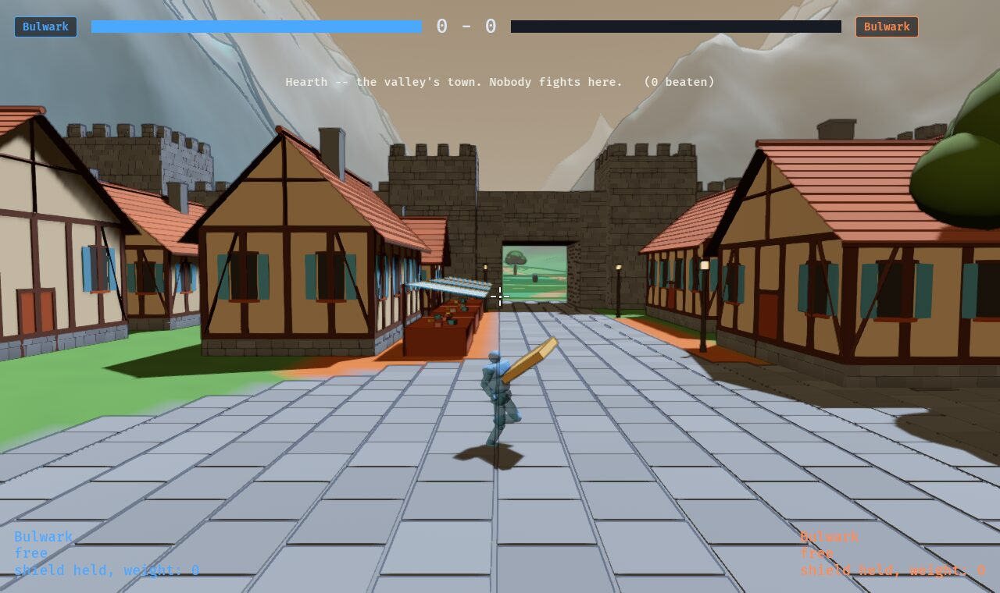
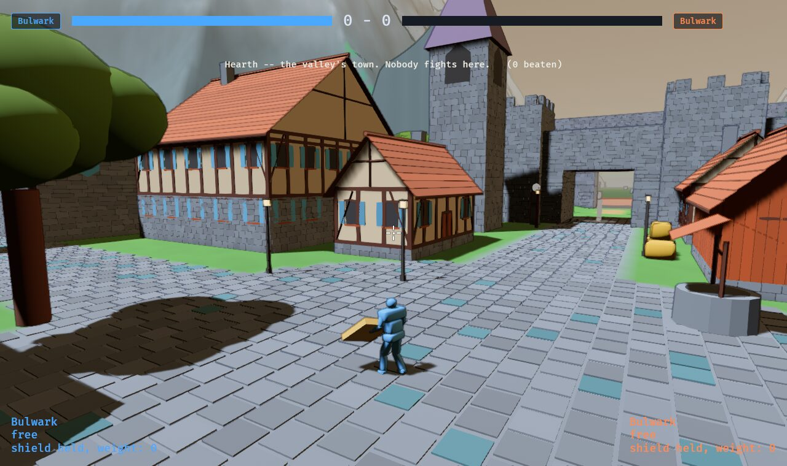
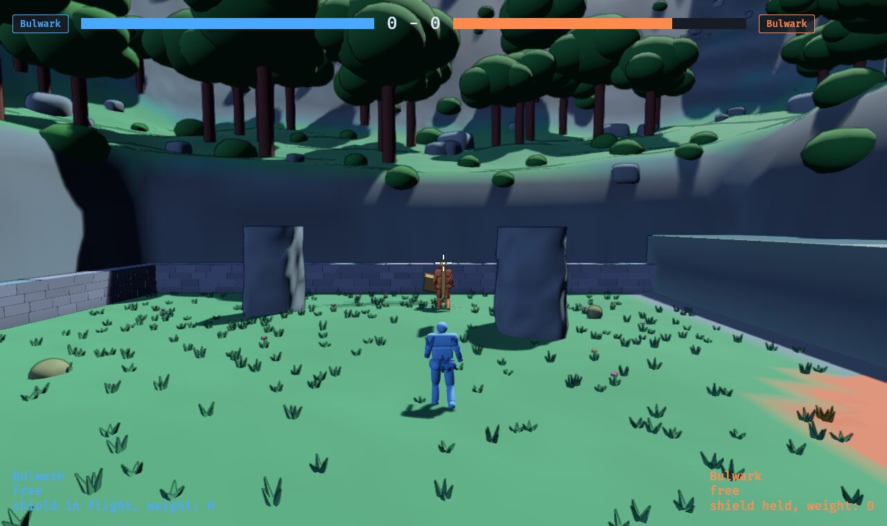
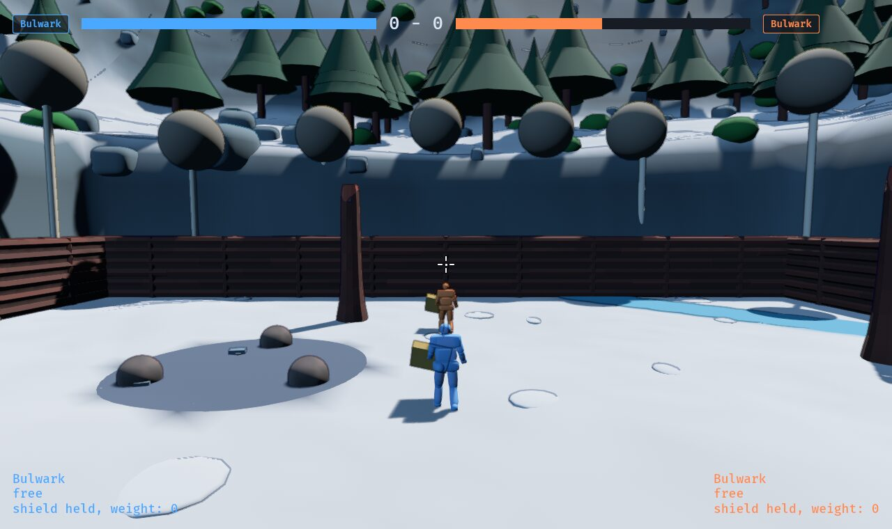
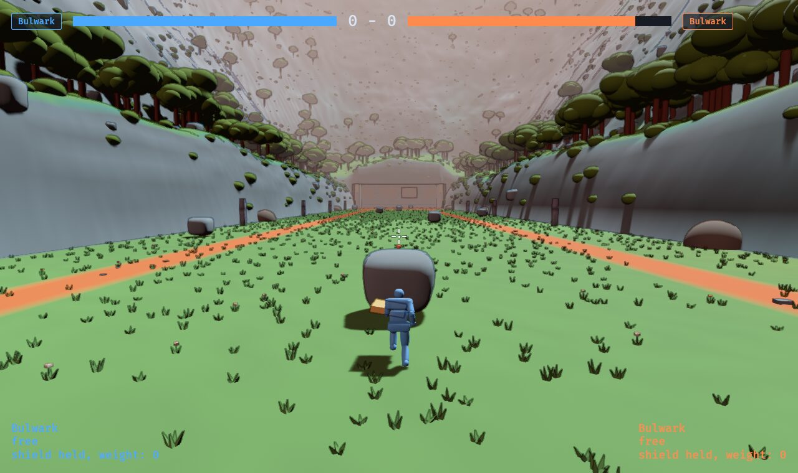
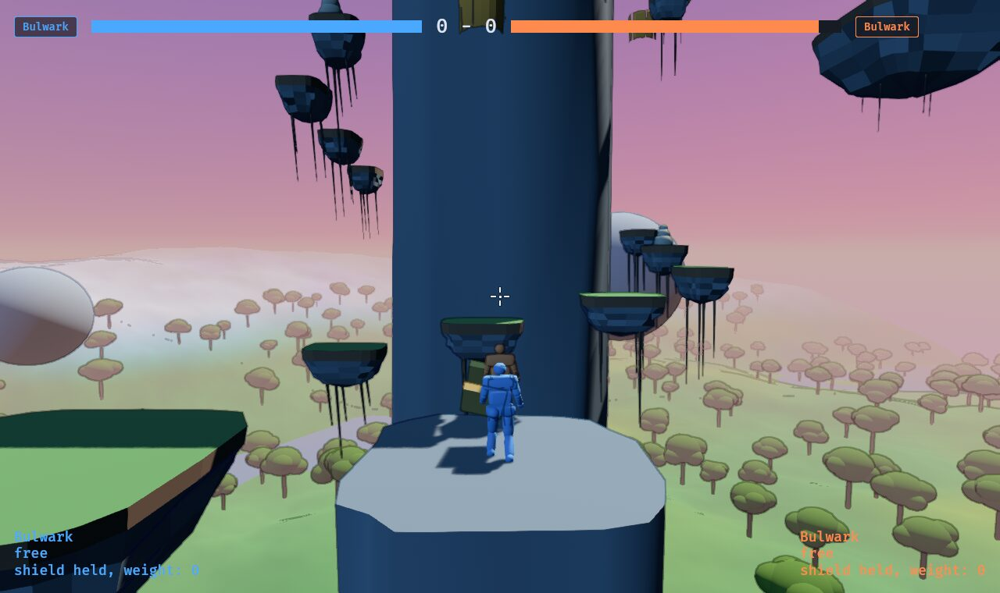

# Forms — less box, same collision

Everything in the game is drawn from the box the simulation collides against:
a fighter's sixteen joints are scaled cubes, a creature's parts are boxes in
their bone's frame, an arena's solids are the boxes bodies stop at. That is
the right source (if you can see it, you collide with it) and the wrong
*look*: a meadow of crates, a cat made of bricks.

**The rule this document proposes:** the box stays the truth and the form is
drawn **inside** it. A rounded box is still inside its box; a rock pulled
inward by noise is still inside its box; nothing is ever drawn where a body
would not stop. So the hit test, the overlay, the camera's arm and every pin
are untouched, and the only question is what a thing *looks* like in the
space it already owns.

## The first pass (built, 2026-10-08)

One mesh family, `shapes::soft_box`: the **superellipsoid**, the surface that
runs from a sphere to a box on one number, with exact normals. And one
roughening of it, `shapes::rock`: each vertex pulled inward by a little
smooth noise, so a stone is a stone and never pokes out of its box.

| What | Was | Now |
| --- | --- | --- |
| A fighter's parts | unit cubes, scaled to the joint's box | rounded boxes: head nearly a ball (0.85), hands and feet soft (0.5), limbs rounder (0.6) than the torso (0.35) |
| A creature's parts | unit cubes | rounded boxes (0.3), one mesh for every species |
| Arena solids of bare **rock** | `boxy` | a rock |
| Arena solids of soft ground (earth, grass, sand, snow, ash, peat) | `boxy` | rounded (0.3) |
| Arena solids of dressed **stone**, timber, water | `boxy` | **unchanged**: a wall is cut square |
| Raised rock (the herd's boulders) | unit cube | one of two rocks |

The accent and the crest (`look::edge`) are painted on the new forms the way
they were on the boxes, so an arena's palette is unchanged.

## The second pass (built, 2026-10-08, on the word "do all four")

1. **Creatures' parts rounded by what they are** (`beast::Forms`): a plate --
   armour, the body -- keeps most of its edge (0.22), a breakable limb is
   rounder (0.5), a weak point is soft (0.7). The part's form is chosen the
   way its skin is, from the same declaration, and swapped per frame with it.
2. **Fighters' limbs are round about the bone** (`shapes::soft_cylinder`:
   round in cross-section, blunt at the ends) and **meet in a ball at every
   joint** that bends -- shoulder, elbow, wrist, hip, knee, ankle (`BodyBall`,
   twelve a body, the Reaver's shadow too). Each ball is the narrower
   cross-section of the limb hanging from it, a hair under, so it never shows
   through a straight limb and only fills the wedge a bend opens -- the rule
   the creatures' knuckles already follow. The head is nearly an ellipsoid;
   the torso keeps its shoulders.
3. **Dressed stone is chamfered**, not rounded (`shapes::chamfered_box`): a
   mason's forty-five-degree bevel of six centimetres on every edge, the
   faces flat. A rounded box at a low rounding was tried first and bent its
   whole face a little, which on a platform six metres across read as a
   cushion. Timber four centimetres; water stays flat; props drawn as boxes
   get the same bevel. Small bodies (the packs' critters) are rounded too.
4. **The floor is broken up by what lies on it**, since its height is the
   simulation's: its colour wanders a little (`shapes::mottle`, 7 % over
   features a few metres across), and dressing is scattered over it by a hash
   of the arena -- tussocks in grass, pebbles on earth, peat, ash and sand,
   drifts on snow, chips on rock -- one per forty square metres (half that on a paved floor), never
   inside a solid, never in water, small enough to walk through unnoticed and
   half buried so nothing has an underside to float on. Not on a course,
   which has no floor.

## The third pass (built, 2026-10-08, on "stones not cuboids, terrain less regular")

1. **The Elementalist's stones are rock columns** (`shapes::rock_column`): a
   lathe whose footprint is a rounded square pulled in by lumps at two
   scales and narrowing a little toward the top, seeded per slot so no two
   stones match, with that same irregular rim filled in **flat at the full
   height** because feet stand on it. The first version was a superellipsoid
   with lumpy sides and read as a machined drum, because its cap was a
   perfect circle at the full radius and from the camera's height the cap is
   most of what you see. Every pull is inward: a stone is still exactly as
   wide as the hit test says.
2. **Four arenas have relief** (`sim::arena::relief`): the floor's height
   is a short table of hills and hollows per arena, each `h · (1 - d²/r²)²`
   inside its radius and nothing outside, summed. Flat at the crown and flat
   at the rim, so it joins the plain without an edge; a few tens of
   centimetres over several metres, so nothing is steeper than a tenth of a
   metre per half metre of floor (`crates/sim/tests/relief.rs`). The low
   meadow, the Commons, the Pan and the Ashwood have it; the proving ground
   and every course stay flat, and so does every arena nobody has written a
   table for.

   **It is the simulation's floor, not a drawing.** The floor term of every
   ground query starts at the relief instead of zero: standing, landing,
   the step-off test, the aiming ray's floor hit (a heightfield march in
   `math::ray_hits_heightfield`), creatures' fences, spawns, where blood
   falls. Feet follow a floor that falls away gently: walking downhill,
   the resolver puts the feet on the floor below when it is within one
   frame of the steepest slope (`StepDown`, 8 cm) rather than leaving them
   for gravity, which otherwise made every descent a stutter of tiny
   falls. That glue runs only where there is relief, and only onto the open
   floor: the flat arenas play bit for bit as they did.

   **What lies on the floor keeps to the plain.** The tables are
   hand-placed so that water lies level, a site (the braziers, the cart's
   road) and a low solid (a step, a trunk, an island) stand on flat
   ground, the meadow's boulders too; a rise may run *into* a tall solid's
   base, but the floor never falls away under one. The same test holds all
   of that, so a bump moved later cannot quietly open a gap under a wall.
3. **Everything drawn flat on the floor is laid on the floor it has**
   (`ground::floor_at`): a hazard's skin, a species' ring, a hunt's sign
   strip, all at the relief's height under their middle and tilted to its
   slope there. The signs ignore depth so they can be read through a leg,
   which on a hill meant a sign at zero floated in every hollow and showed
   through every rise; a sign a few metres long on a slope this gentle stays
   within a hand of the ground at its ends.
4. **The relief is drawn at the simulation's heights** (`shapes::ground_grid`,
   half a metre a cell, and `ground_disc` for the trodden patches and pools
   on it), with normals from the height function. A hill of a few degrees
   under a high sun is a few percent of shading, which is a hill nobody
   sees, so the floor is also **shaded by height** by the look's own rule
   (`look::palette::relief_shade`: a tenth lighter at half a metre up, a
   tenth darker at half a metre down) -- the sky a crown sees and the dust
   a hollow collects, as one number per metre.

## The fourth pass (built, 2026-10-08, for the valley)

1. **Terrain is a cliff, not a rock.** The rock form pulls a surface in by
   up to a quarter of its own size, which is a lumpy boulder at two metres
   and seven metres of air under your feet at thirty. A box more than six
   metres across or tall, in a soft material or rock, is drawn by
   `shapes::cliff`: each face a grid a metre and a half a cell, pushed in by
   at most 0.35 m along its normal by noise, fading to nothing a metre from
   the face's border, and the top kept flat. A turf-topped terrace shows
   rock in its faces (`look::palette::cliff_face`); a thin one, a hedge, is
   its own stuff all the way down.
2. **Three meshes were facing the wrong way, and are tested now.** The
   relief's floor (`ground_grid`) was wound facing down, so every hilly floor
   was culled from above and the sky's horizon showed through where the
   grass should have been -- the low meadow and the other relief arenas have
   been a pale wash since the third pass. The first cliffs had the same
   order in both arms of their winding test, so a grass terrace showed the
   inside of its own underside in rock colour. And the rounded forms'
   poles were millimetre rings drawn inside out, because a float's cosine
   of minus ninety degrees is a hair below zero. `shapes::tests` now checks
   that every closed form's triangles face out and every floor's face up,
   which is the check that would have caught all three.

## The fifth pass (built, 2026-10-09: "like Guild Wars 2")

The owner, on the valley turned to land: *fix the town, all the fights, and
every jump map in the same style -- directionally more like Guild Wars 2 --
not just the walls, but the terrain, buildings, and objects too.*

1. **A box is drawn as what it is** (`game::forms`, `form_of`): one rule from
   its material, its shape and whether it floats, so a new arena's walls come
   out walls without anybody choosing. Each form is one mesh built of parts
   (`forms::Kit`), **inside its box** with its top at the box's top wherever a
   body stands (`forms::tests::every_form_stays_in_its_box`).

   | Box | Form |
   | --- | --- |
   | Dressed stone | **Masonry**: a mortar core, every face laid in courses of blocks a little proud of it, joints staggered, the odd top stone mossed, the top flagged |
   | Dressed stone, tall and thin | a **column** (plinth, fluted shaft in drums, capital, abacus) over six metres; a **standing stone** with a carved band under it |
   | A long low run of rock | a **dry-stone dyke**: field stones through the wall's thickness, the top course mossed |
   | Rock, tall | a **spire** (`rock_column`, banded, mossed where it faces up), in the crag's lighter rock (`Palette::crag`) |
   | Timber, long and tall | **cordwood**: logs laid lengthways, staggered, between posts |
   | Timber, long and low | a **fallen log**: an ellipse to fit the box, bark, a root plate, stubs of branches |
   | Timber, tall and thin | a **dead trunk**, flared at the foot, broken off round a flat heart |
   | On a course: turf or snow, floating | a **floating island**: a slab of turf with a lip of soil over a lump of rock tapering beneath it, a few short roots |
   | On a course: sand | a **stepping stone**, a fallen column's drum |
   | On a course: timber | a **scaffold**: planks on beams on braced posts |
   | Anything else | what it was: a rock, a cliff (a low outcrop of rock mossed on top), a soft mound |

2. **A fight's ground is land** (`game::land::draw_arena`): the floor and its
   rim ([arenas.md](arenas.md) §1a) drawn a tile at a time like the valley's,
   at the simulation's heights, coloured by `Palette::land` (rock where it
   steepens, with strata on a face too steep to stand on), and past the rim
   the woods: trees beyond the crest (`land::Trees`, broadleaf or pine by
   place), bushes and boulders on the bank. The old dressing that stood past
   a wall (birches round the Ashwood) gives way to it.
3. **The floor's scatter is one mesh of thousands** -- broad short tufts of
   grass (tall thin blades took the outline round every one and drew the
   meadow in ink), a flower now and then, pebbles on earth and sand -- on the
   floor and on any top broad enough to be ground (the Cliffs' plateau).
4. **The town is a town** (`sim::arena::hearth`, `game::town`): buildings,
   towers, props and trees are tables, and their collision is made from the
   tables -- a house is a box to its eaves, three boxes stacked inside its
   roof's slopes, a chimney -- and the renderer draws each from the same
   entry: a stone footing, plaster between dark timbers with braces, windows
   with shutters, a door to the street, tiled roofs in overlapping courses
   with overhanging eaves, gables, ridges. Crenellated walls and towers,
   arches over the gates, banners, the bell tower's spire, flagstones, an
   inn's sign, stalls under striped awnings, barrels, crates, a cart, hay,
   lamps that glow, a well with a roof.
5. **A course floats over somewhere** (`game::land::draw_below`): hills and
   woods far under the islands, hazed by the air, instead of a dark floor.
6. **Trees are trees**: a trunk as thick as the tree is tall would have it, a
   broadleaf a canopy of clumps rather than a ball on a stick, bark weathered
   grey (`Palette::bark`) rather than painted red.

New colours, all derived from a place's palette (`look::palette`): `mortar`,
`moss`, `soil`, `roof`, `plaster`, `framing`, `cloth`, `bloom`, `crag`.

## What to decide

1. Is the amount right? Each is one number: the rock's roughness (0.28 of
   its size), the stones' (0.1), the chamfer (6 cm), the mottle (7 %), the
   scatter's spacing (40 m² a piece), the relief's shading (a fifth per
   metre) and the height of the tallest hill (0.6 m).
2. The scattered dressing is procedural and the same every time for an
   arena; a creature's document may want its own (the Sandmaw's Pan has
   islands and bones already). The hand-placed props win on the eye, the
   scatter fills behind them.
3. Next, if wanted: silhouettes rather than forms -- a creature's parts
   tapered along the bone (a leg thicker at the haunch), which is a shape per
   part rather than a rounding per kind, and the first thing that needs an
   eye rather than a rule.
