# Gallery — every creature, its arena, and a telegraph

Headless captures of the bestiary as built (2026-10-01), for
[review.md](../review.md). Desktop renderer under a software Vulkan driver,
1280 × 760 scaled to 960 wide; the HUD is left on (the picker's list at the
right, frame number at the top). Player one is the Bulwark, standing still
(`DEMO=0`); the second fighter is player two.

How each was taken, so it can be taken again (`./scripts/screenshot.sh` with
these in the environment): the arena shots are `GAME_ARGS="--hunt <x>"`
with `SHOT_FRAME` 150–240 and a `SHOT_PITCH`/`SHOT_YAW` that puts the creature
on screen; the telegraphs are `SHOT_MOVE=<move>` with `SHOT_FRAME` 10–15, the
creature placed winding that move up at player one.

## In their arenas

| | |
| --- | --- |
|  **Ridgeback**, the proving ground — `--hunt ridgeback`. |  **Gnawers**, the Commons: the pack coming in along the wall, the Big One at the right. |
|  **Hornback herd**, the low meadow: the bull and the herd beyond the boulders. |  **The crossing**: the cart on the road, the herd ahead of it. |
|  **Mireback**, the Mire: the toad, and a brazier on its plinth. |  **Sandmaw**, the Pan: nothing to see — it is under the sand until it chooses to be; the rock islands. |
|  **The Pair**, the Den: a cat on the far platform. |  **Broodmother**, the Hollows: her legs and body under the vault. |
|  **Veilstalker**, the Ashwood: nothing to see, by design — snow, ash pits, braziers, the stream. |  **Mantis**, the Shrine: coming in between the columns. |
|  **Galewing**, the Cliffs: the bird overhead, out of reach. |  **Siegeshell**, the Last Valley: its legs and shell, walking at you. |

## A telegraph each

| | |
| --- | --- |
|  **Ridgeback, the bite**: its floor marker filling under you. |  **Gnawers, the pile-on**: the ring crouching, each with its lane. |
|  **Hornback, the charge**: the bull's lane drawn ahead of it. |  **Mireback, the belly flop**: the ring of warnings under the toad's landing. |
|  **Sandmaw, the rise**: the column breaking the sand and the circle it comes up in. |  **The Pair, the pounce**: the landing circle under you, the cat on the platform. |
|  **Broodmother, the slam**: her footprint drawn on the floor. |  **Veilstalker, the tail spear**: the shimmer and the lane — all you see of it. |
|  **Mantis, the lunge**: its lane down the court. |  **Galewing, the Stoop**: the circle where it will hit, the bird above. |
|  **Siegeshell, the stamp**: the foot over you and its disc. | |

## The jump courses

Taken 2026-10-04, rounds four and five, with `GAME_ARGS="--arena <name> --p1 <class> --p2 <class>"`,
`SHOT_FRAME=60`, `DEMO=0` and a `SHOT_PITCH` per course (about −0.2 looking out,
near level at the Spiral and the Spire); see [courses.md](../courses.md). The panel
at the right is the course list and the run. Grass is a path island, sand a
stepping stone, snow a checkpoint, wood the nest; grey rock is never the route.
Every tier is an unplayed guess. The panel lists each course's big jumps (round five).

| | |
| --- | --- |
| 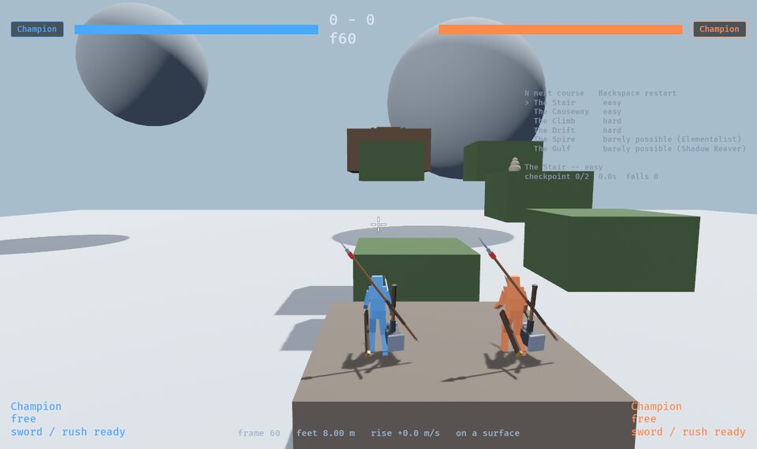 **The Stair** (easy), the Champion. | 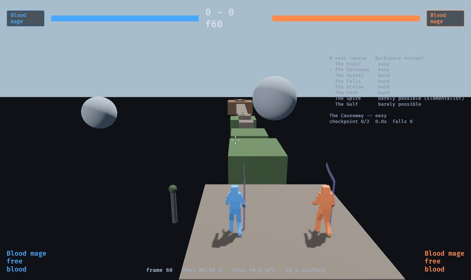 **The Causeway** (easy), the Blood mage. |
|  **The Spiral** (hard), the Elementalist: ledges climbing round the pillar, the pad on the left, the chimney's balcony up and right. | 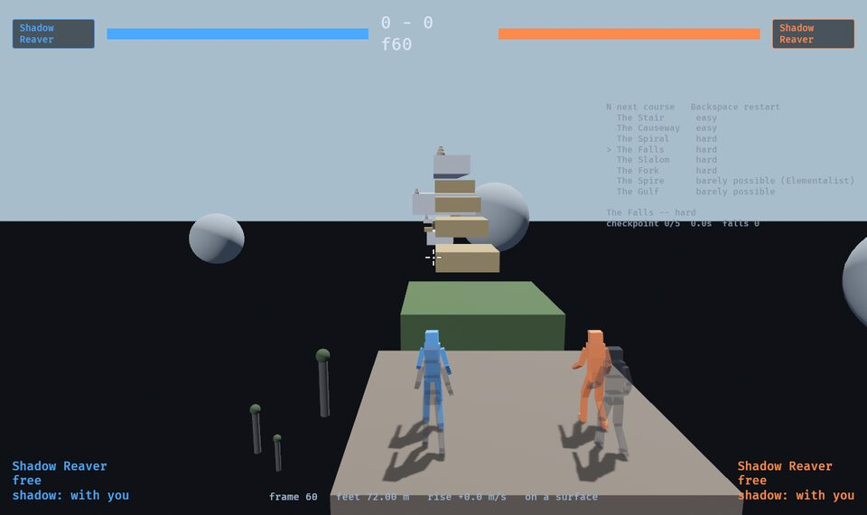 **The Falls** (hard), the Reaver: the stair and the arch ahead. |
| 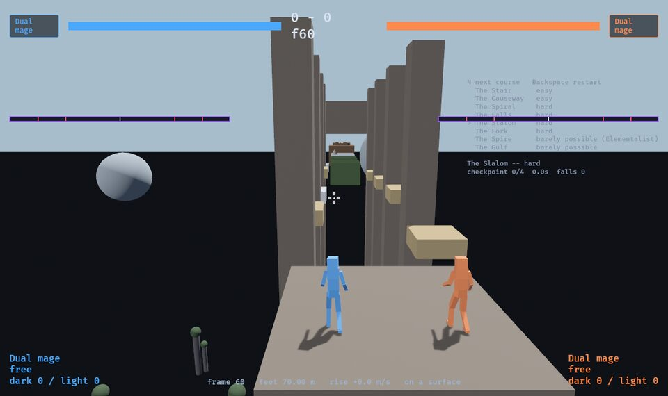 **The Slalom** (hard), the Dual mage: stones between the pillars, the cave mouth beyond, the span's runway on the left. | 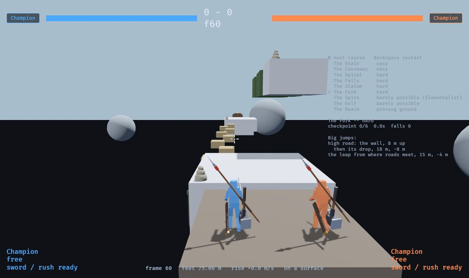 **The Fork** (hard), the Champion: the high road's wall up and right, the low road's stones ahead. |
| 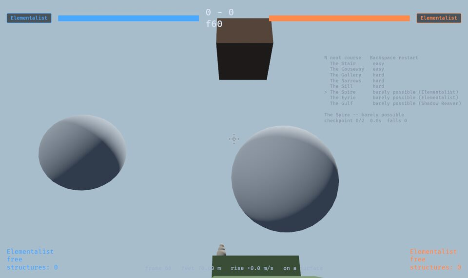 **The Spire** (barely possible), the Elementalist. | 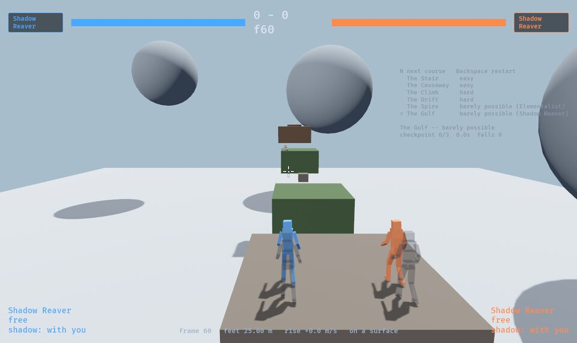 **The Gulf** (barely possible), the Reaver: the runway, the 18 m gulf, the high line up and right. |
| 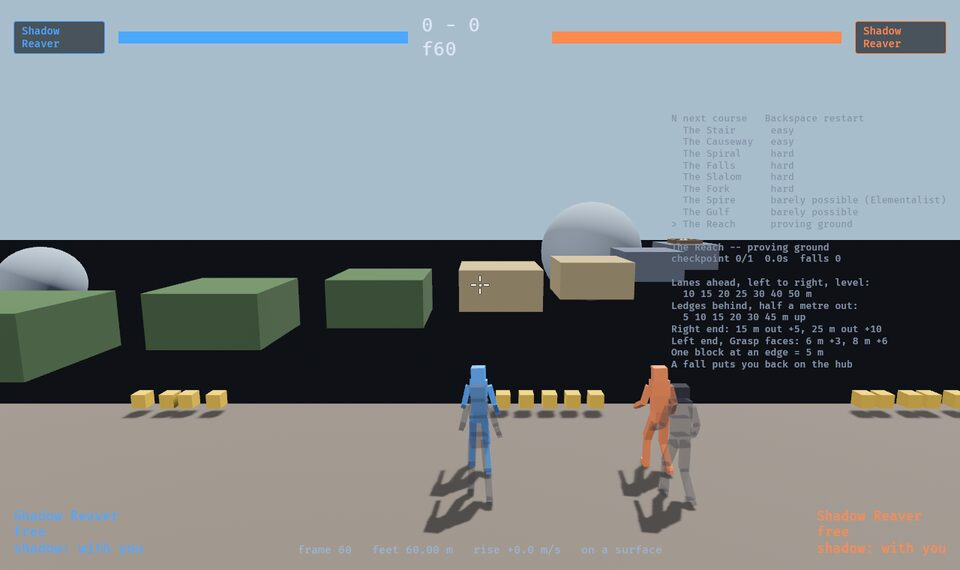 **The Reach** (proving ground), the Reaver on the hub: the gap lanes ahead, a yellow block per five metres at each takeoff. | |

## The valley

Taken 2026-10-08 with `GAME_ARGS="--arena <place>"` (Hearth with nothing, since
it is where the game starts), `SHOT_PITCH=0.12` and the Bulwark's demo
throwing slams; see [valley.md](../valley.md). The line under the scoreboard
is the valley's: the place, and how many creatures the journey has beaten.
The plan beside them is `cargo run -p look --example valley`.

| | |
| --- | --- |
|  **The plan**, every place from above, Hearth at the top: seams boxed (gold open, grey behind a waystone), waystones yellow, cairns white, vines green, updrafts pale rings. |  **Hearth**: the square, and the stair up the inside of the wall to the lookout on the left. |
| 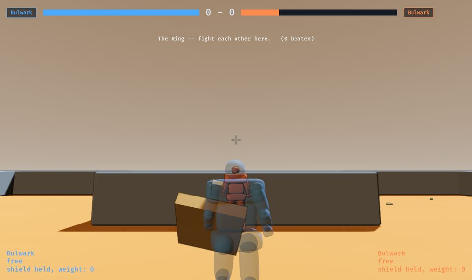 **The Ring**, through Hearth's north door: the proving ground in sand, the one place you can fight each other. | 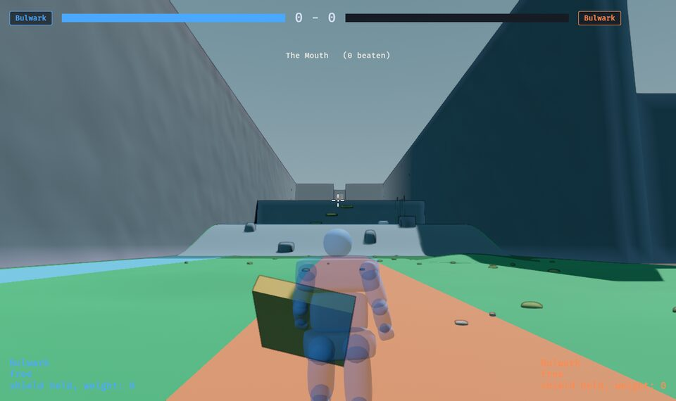 **The Mouth**: the road out of the gate, the river on the left, the scree rising to the Step. |
| 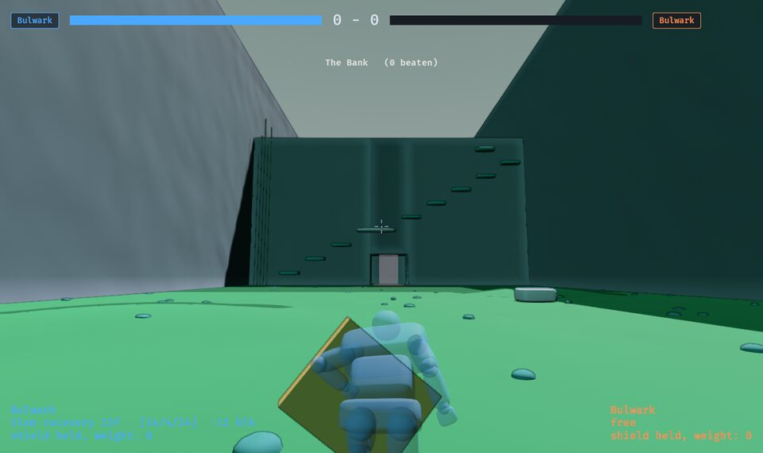 **The Bank**: the den's mouth at the foot, the ten-shelf stair up the face, the vine at its south end. | 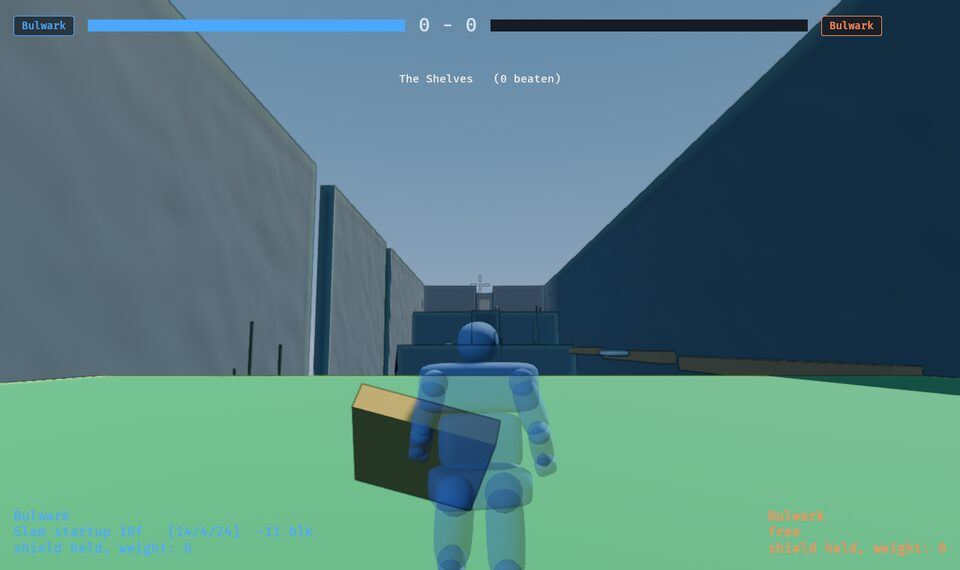 **The Shelves**: on the first terrace, the traverse's ledge along the right-hand wall. |
| 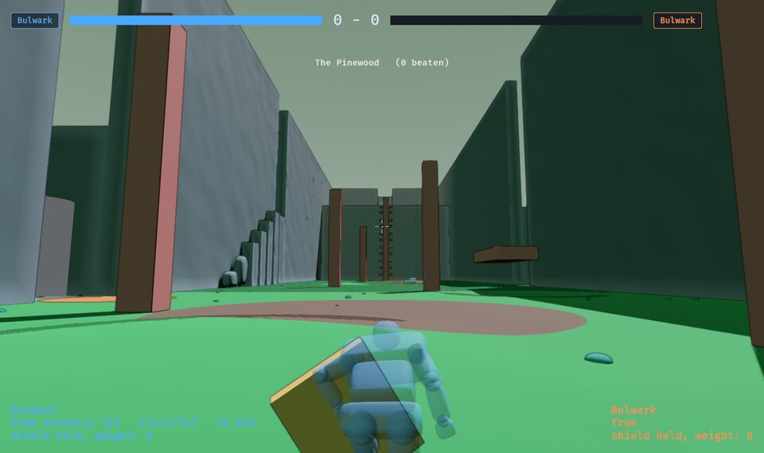 **The Pinewood**: the trunks, the Highlands' stair up the left wall, the chimney's ledges between the giant trunks ahead. | 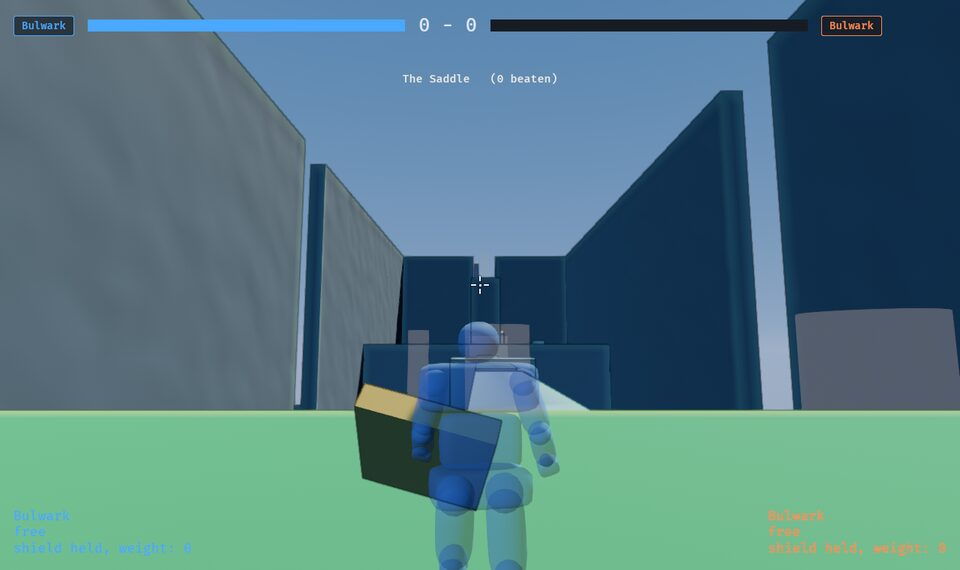 **The Saddle**: on the west platform's turf, the ridge running out ahead to the spires. |
