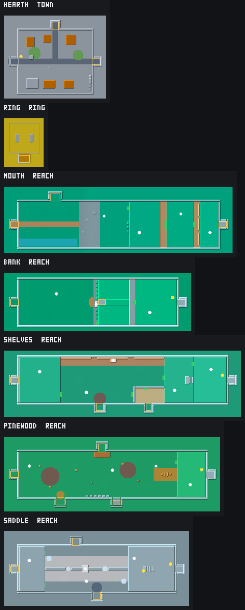
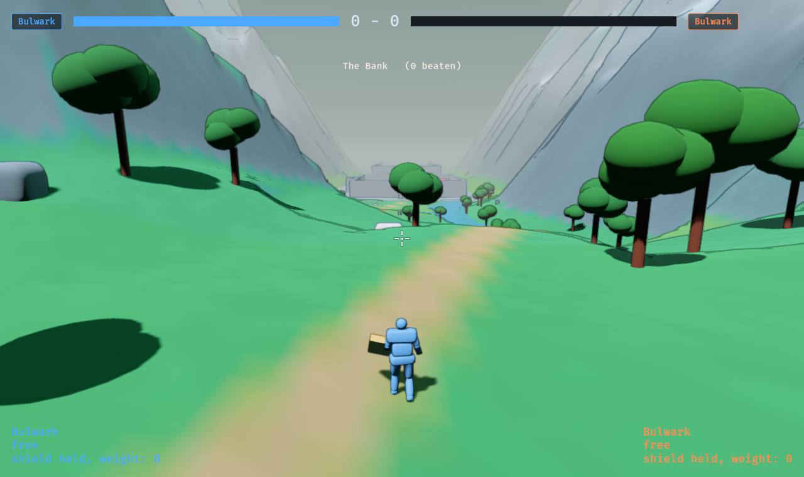

# The valley — a world to climb with a friend

*Built 2026-10-08, from [exploration/0006](exploration/0006_valley.md), and
**unplayed**. Where this and the note differ, this is what was built and
the note is how it was argued.*

***One map since 2026-10-09.*** *The places are no longer joined by seams you
stand in to be teleported: they are laid out on one map, and you walk from
the town to the Saddle and into every room. How, and the tiles and distance
loading that make it cheap, is [atlas.md](atlas.md); what changed here is
marked below.*

* The code is `crates/sim/src/valley.rs` (the
rules), `crates/sim/src/arena/{hearth,ring,mouth,bank,shelves,pinewood,saddle,highlands}.rs`
(the places), and `crates/game/src/valley.rs` (what is drawn and said).*

**The valley is where the game starts.** `cargo run -p game` puts both
players in Hearth's square. `--versus` is the proving ground as it always
was; `--hunt <creature>` and `--arena <name>` start what they always
started. In the browser the query string does the same (`?versus`).

| Key or flag | What it does |
| --- | --- |
| *(nothing)* | Start in Hearth |
| `V` | Back to Hearth from anywhere, both of you, with the journey kept |
| `--dev` | Also shows how much of the map is loaded, under the place's name |
| `--versus` | Start in the proving ground instead |
| `--open` | Every waystone lit, as if every creature had been beaten: for walking the whole valley without the fights |
| `--arena mouth` (and `bank`, `shelves`, `pinewood`, `saddle`, `hearth`, `ring`) | Start in that place, in the valley |

*The plan sheet: `cargo run -p look --example valley` draws every place from
above in one picture, the climbs' heights as shades and the seams as
colours.*

---

## 1 · The shape: a valley, with rooms off it

One climb from Hearth's gate to the Saddle, **one map** of land since
2026-10-09 ([atlas.md](atlas.md)): a road winding up a valley between
mountains, a river in its first meadow and a tarn under the Shelves' north
slope, woods thickening into the Pinewood and thinning into the Saddle's
snow. The creatures' arenas are **rooms** in clearings off the road, each at
the end of a side path, so every fight is the arena it was tuned in. Hearth
sits at the bottom of the climb, the Ring north of it and the Long Valley
west, where the Siegeshell walks toward the town.

| Place | The road | Rooms off it | The way on |
| --- | --- | --- | --- |
| **Hearth** | — | **the Ring** (north), **the Long Valley** (west, under the fifth waystone) | the east gate |
| **The Mouth** | Out of the gate between low hills into a river meadow fifty metres wide; a crag with a cairn; the road climbs the scree, sixteen metres in two bends, to the Lip | the low meadow (Hornback herd), up a side path north | the Lip |
| **The Bank** | A broad upper meadow; the old stair as a crag; the road climbs the bank, twenty-one metres | the den (Gnawers), north | **first waystone**, a pass between two shoulders of hill: one of the herd, the den |
| **The Shelves** | A long open bowl with a tarn under its north slope; a crag by the shore; the road climbs out | the Mire (Mireback) and the Pan (Sandmaw), down side paths south | **second waystone**: one of the Pan, the Mire |
| **The Pinewood** | Pines thick on both sides and up the slopes; a crag among them; the road climbs out twenty-six metres in two bends | the Den (the Pair) south, the Hollows (Broodmother) north, the Highlands (Ridgeback) up a side path south four metres higher | **third waystone**: two of the Pair, the Broodmother, the Ridgeback |
| **The Saddle** | A snowy alpine meadow between peaks; the highest crag; the road ends at a view | the Cliffs (Galewing) over a bridge north, the Ashwood (Veilstalker) south, the Shrine (Mantis) up a switchback north-east behind the **fourth waystone**: one of the Cliffs, the Ashwood | — |

The tiers are world.md §3's, and the gates are exactly what that table says
(`valley::tier`). **The Ridgeback has a room of its own**, the Highlands: the
proving ground's floor plan on a moor, so meeting it in the valley is the
fight it was tuned in, and `arena::for_species` still sends `--hunt ridgeback`
to the proving ground.

Not built from world.md §2: the Crossing (the herd's escort mode stays a
`--hunt hornback-escort` fight). A room is visible from its side path now,
but its creature is not put on its marks until you walk in.

## 2 · The rules

All of them are in `World::step_valley` and `sim::valley::open`, and all
of them only run when the world is the valley (`Journey::on`). Outside it
nothing here happens and nothing here is hashed, so every pinned fight
hashes as it did.

- **A seam** is the mouth of a passage or a notch where two places meet, and
  seams come in pairs (`tests/valley.rs` checks every pair). Since
  2026-10-09 it is a doorway, not a trip: **you walk through it**. The world
  runs in the coordinates of the place the first fighter on their feet is
  in, and moves into the next place's when they cross (atlas.md). Every
  doorway is walked through by `tests/valley.rs`.
- **You no longer have to go together.** The rule that a seam fired when
  everybody stood in it, or one had held it for `seam_hold`, went with the
  teleport: there is nothing to go *to* that the other cannot walk to after
  you. The two of you can be apart; one live hunt at a time.
- **A waystone** gates a seam that leads on. It is lit when enough of its
  tier have been beaten, counted from the journey's bitmask. An unlit one's
  doorway is **a wall**, drawn as a dark slab, and the screen says what it is
  waiting for; it stands only while nobody is on its far side, so going back
  down is never gated.
- **What has been beaten** is the journey's, and a creature gets there two
  ways: a hunt won in the valley, and each player's trophies. A trophy is
  off the snapshot, so the game sends each one on the wire as a trip byte
  (`Destination::Credit`) and both peers credit it on the same frame. The
  pair's journey is the union of both players' trophies: the note's "the
  more travelled of the two", and world.md §5's "a locked place is locked to
  the lone player, not to the pair".
- **A cairn** is a snow top. Touch one and you are rested (health back) and
  it is your checkpoint.
- **Nobody dies in a reach.** A fighter whose health runs out — a fall
  costs what the fall rule says, free to 9 m and 25 a metre past it — is
  stood on their last cairn, or on the place's arrival marks if they have
  touched none, with their health back.
- **Peace.** In the town and the reaches the two of you cannot hurt each
  other: `World::pvp()` is false, and every place that used to ask "is this
  versus" asks that instead. **The Ring is the one place for fighting each
  other** (the ask was "make sure Hearth has an arena for PvP"): the proving
  ground's square to the centimetre, sand for earth, rounds as versus plays
  them, the dummy or the sparring bot as player two when nobody has the
  second keys. Hop its south wall and walk into the door to leave.
- **A room starts its hunt** when anybody walks into it. Win it and the
  place goes quiet: the round does not restart, and you walk out the way you
  came. Lose it and you wake outside, at the seam you went in by. You can
  run: when nobody on their feet is left in the room, the hunt is over,
  unwon, and the creature is gone; walk back in and it starts again.
- **A room has ground round it.** Most rooms are walled with low walls,
  which ended the world when a room was all there was. On one map a room has
  six metres of ground round its walls and a cliff round that.
- **Player two, unplayed,** is not in the valley: kept a kilometre under the
  place's floor where nothing reaches it, rather than a body lying at every
  seam. In the Ring and in a room the second seat plays as it always has.

The journey is a few bytes of the snapshot: whether this is the valley, the
beaten bitmask, the seam you came in by, and each fighter's last cairn (a box
of the map, by its index there).

## 3 · Climbing, as built

**The road climbs on foot** since the valley became land: every rise on it
is a slope a body walks up, and the whole road, and the way into every room,
is walked from end to end by `tests/valley.rs` (`the_whole_road_can_be_walked`,
`every_room_can_be_walked_into`). Nothing on the main route needs a jump.

**The climbs are crags beside the road**: a pillar of rock with ledges up one
face, each a rise of 2.2 m and a metre across from the last, and a cairn on
its top — a view, a checkpoint, and a jump every class makes with a plain
running jump (`REQUIRED`, checked against `sim::envelope`). A vine down the
crag's other face is the slow way up, for anyone: hold jump to climb at
`vine_speed`, crouch to slide down, otherwise cling.

**The mountains are the edge**: ground steeper than `terrain_steepest` is a
wall you slide back down, so the valley needs no boxes to keep you in it
(atlas.md §The land).

Updrafts (`PLACE.vents`) are still a prop the movement reads, and no place of
the valley has one now: the Saddle's ridge they crossed is gone.

## 4 · What is drawn and said

`crates/game/src/valley.rs` draws, for a place that is in the valley:

- the land, tile by tile out to the fog, with its road worn in, its water,
  its trees and rocks (`game::land`, `game::stream`);
- every seam to a room, and every waystone's pass, as a signpost: a slim
  pillar of light and a pool at its foot, lit or dark (`Palette::beacon`).
  Where one reach runs on into the next there is nothing to mark;
- a dark waystone's doorway as a slab of its grey, while it is shut;
- each waystone's light on its stone's top;
- vines, from the ground to the top of the crag they hang on;
- from Hearth's wall, the reaches themselves, as far as the fog lets you
  see. (The painted ridges that stood in for them went when the valley
  became one map.) Only what is within the sky's reach is drawn
  (`game::stream`, atlas.md);
- one line under the scoreboard: the place, how many creatures the journey
  has beaten, and while somebody stands in a seam, where it leads or which
  waystone is dark.

## 5 · Measuring it

The note said the instrument is a pair's replay, not a search, and the
harness reads one now. `cargo run -p hunt --bin replay -- <tape>` on a tape
recorded in the valley prints **THE VALLEY**: every place visited, how long
the pair spent there, falls, and how each was left — by which seam, and
whether both were in the next place when the world moved into it
("together") or not ("apart"). `crates/hunt/tests/replay.rs` walks two fighters out of
Hearth's gate and into the Mouth and checks the report says so.

The target was **three minutes end to end for a runner who knows it, five
for a pair who does not.** The five reaches are 974 m end to end with about
125 m of climbing, close to the note's arithmetic for three minutes. Nobody has run it yet.

## 6 · Open

1. **Nobody has played it.** Every height, gap and hold is a first guess
   sized against the jump envelope. Record a pair's run (`Y`) and judge it.
2. **The Bulwark sets the gaps.** Every required hop is within its plain
   jump, which makes them easy for everyone else. The mechanics are the
   shortcuts (a stone, a shadow, a Grasp over a bluff), but the gaps are not
   yet wide enough to *need* one anywhere. Whether some climbs should have
   only the slow way for some classes is the next tuning question.
3. **The Siegeshell does not come to you.** World.md §3 wanted the bells to
   ring in Hearth when the Shrine's waystone lights. It is walked to, by the
   fifth waystone, from either end.
4. **The armoury, the bot's corner and the hunter's notes** in Hearth are
   solids with nothing in them yet.
5. **The seam hold** is gone with the teleports (2026-10-09), and its knob
   with it.
6. **One map**: everything [atlas.md](atlas.md) §Open lists -- how the joins
   read, the sky changing at a doorway, the Long Valley's loop.
